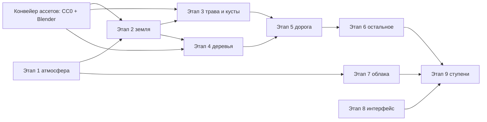

# Рендер мира v2: задание

2026-09-26. Основание — разбор Steam-версии slowroads (`docs/slowroads-steam.md`, заметки в `docs/slowroads-steam/notes/`) и карта наших швов (`docs/slowroads-steam/notes/OurWorldSeams.md`). Владелец утвердил:

1. Разбор slowroads, затем рендер мира с нуля. Геймплей остаётся: физика, машины, трафик, игрок, детали, предметы, сохранения.
2. Фото-ассеты CC0 разрешены.
3. Работа на старой системе остановлена. Осенние деревья и листва — на ветке `wip/autumn-old-renderer`, объёмные облака — на `wip/volumetric-clouds`.

Этот документ — задание для исполнителей (людей и агентов). Каждый этап заканчивается проверкой в кадре игры рядом с кадром slowroads с той же точки.

## Цель

Картинка уровня slowroads (кадры `docs/slowroads-steam/img/`): средняя полоса России, четыре сезона, непрерывные сутки, погода. При этом наша физика, машины, мокрая дорога и дождь, звёздное небо и сезон, который меняется с расстоянием.

**Мерило.** Кадр игры с тех же ракурсов (у машины, вдоль дороги, лес, поле, даль) рядом с кадром slowroads Ultra. Неспециалист не должен сказать, какой кадр «дешевле».

## Правила

- **Чистая замена по системам.** Каждый этап заменяет старую систему целиком и удаляет её код. Двух версий одной системы не держим, флагов «старый/новый» нет. Игра работает после каждого этапа.
- **Генерация мира не меняется.** Высоты, дорога, данные покрова, деревья (`plantTrees`), реки, озёра, деревни остаются. Смешанные модули (`deserttiledata.ts`, `deserttiles.ts`, `terrainmesh.ts`, `forest.ts`, `props/trees.ts`) делятся: генерация и физика остаются на месте, рендер уходит в новые модули.
- **Контракты, которые нельзя сломать** (из карты швов):
  - высоты тайлов равны коллайдеру;
  - `groundHeightAt`, `tileSurfaceSampler`, `sampleGroundHeight`;
  - `treeShape`, `treeVariantCount`, `trunkColliderRadius` — коллайдеры стволов. Эти функции уезжают в модуль без рендера, раскладка вариантов не меняется;
  - `TERRAIN_COLLIDER_SURFACE`;
  - API травы `trample`;
  - контракт `Sky` для остальной игры: `sunDirection`, `dayFactor`, `lampFactor`, `artificialLightFactor`, `sunColor`, `setWeather`, `setQuality`, `scene.environment`, `renderer.fog`;
  - `SeasonState` и `WeatherState` на кадр;
  - периоды текстур в координатах относительно начала отсчёта делят 1000 м (перескок начала отсчёта).
- **Ассеты.** Только CC0: Poly Haven, ambientCG, собственные рендеры в Blender 5.2 (`/Applications/Blender.app`). Для каждого файла записываются источник и лицензия (`public/look/LICENSES.md`). Исходники и скрипты сборки лежат в `tools/look/`, готовые текстуры — в `public/look/` (webp; бюджет всего набора около 60 МБ, у slowroads 89 МБ). Серые текстуры подкрашиваются в шейдере: сезон — это краски и смена набора текстур, а не перекраска пикселей.
- **Свет — приёмы, а не физика.** Lambert плюс заплатки. Наш комикс-шейдинг (`comic.ts`) для мира уходит. Тушь остаётся настройкой стиля поверх, но только если на кадрах она не портит новую картинку.
- **Одна игра на сессию, одна вкладка.** Кадры снимаются через общий инструмент (`game_shot`), никаких своих браузеров. Никаких циклов бенчей. Проверка — кадры и один взгляд на `renderer.info` и строку `[perf]` игры.
- **Бюджет кадра** (M2 Pro, standard, 2.25 Мпикс): GPU ≤ 10 мс, ≤ 250 отрисовок, ≤ 1.5 млн треугольников. Сейчас 12.6 мс и около 400 отрисовок.

## Общие строительные блоки

Делаются в первых этапах, используются всеми остальными.

1. **Трёхцветный туман** (`render/look/fog.glsl.ts`). Заменяет `FogExp2`, высотную дымку `lightshader.ts` и «воздушную вуаль» пост-прохода. Цилиндрическое расстояние, затем три шага:
   - обесцвечивание по `d/far`;
   - уход в цвет дымки C по `(d/far)²`;
   - туман к градиенту горизонт A → зенит B по `2·sin(высоты над горизонтом)`.

   Ясный день: без тумана до `near·far` (0.8–0.9), дальше EXP2 с `density = √5/far`. Плюс низкая дымка с шумной высотой: положительная — туман в низинах, отрицательная — «вершины в облаке». Подключается ко всем материалам мира одной заплаткой.
2. **Таблица красок** (`world/look/palette.ts`, чистые данные). Сезон × время × погода: цвета тумана A/B/C, near, дымка, солнце (цвет, сила), рассеянный и полусферический свет, `fresnel`, `radiance`, `shadowFactor`, краски земли (`grassA/B`, `peakA/B`, поля), подкраска деревьев, краски облаков.
   - **Время непрерывное.** Узлы таблицы ставятся по высоте солнца: ночь < −12°, сумерки, утро или вечер (по знаку азимута) ≈ 0–15°, день > 25°. Между узлами — интерполяция.
   - **Погода непрерывная** (ясно ↔ пасмурно по `overcast`).
   - **Сезон** — по каналам `turn / dry / bare / snow / fresh`.
   - Стартовые значения — из заметок slowroads как относительный ориентир. Сами числа подбираются по нашим кадрам под нашу тональную кривую (ACES, экспозиция 1).
3. **Функция краски земли** (`render/look/groundcolor.glsl.ts`). Одна на землю, траву и кусты: серое фото × смесь четырёх красок по шумам 100 м / 4 км и карте пятен 500 / 2000 м. Светлые кончики травинок тянутся к `peak`.
4. **Заплатка света мира** (`render/look/lighting.ts`). Lambert. Запечённая тень (атрибут или униформа): прямой свет × (1 − тень), рассеянный × (1.75 − clamp(тень, 0.75, 1)). Сюда же «френель» земли (формула из заметок) и «сияние» (прямой свет × (1 + radiance·альбедо)). Под пологом рассеянный свет тянется к зелёному.
5. **Шумы** (`public/look/noise_*.webp`). Тайловые, 512², свои (сгенерированы кодом при сборке ассетов): `noise_fine`, карта пятен, деталь ближняя и дальняя.

## Этапы

### Этап 1. Атмосфера и свет

- Трёхцветный туман на всех материалах мира. Удалить высотную дымку, вуаль пост-прохода и `thinFog`-заплатки.
- Небо: купол, окрашенный той же формулой. На нём наше солнце (диск и ореол, мягкие, в цвет света), луна и звёзды (существующие `astronomy.ts`, `starcatalog.ts`, `planetfield.ts`). Звёзды гаснут к горизонту и тонут в тумане.
- Облака: карточки удалить. Временный слой — изогнутая плоскость у камеры с двумя слоями шума на разных высотах и настоящим параллаксом, вписанная в туман, цвета света и тени из таблицы (приём slowroads). На этапе 7 его заменят объёмные облака; плоскость останется для слабых машин.
- Свет по таблице: настоящее направление солнца из `astronomy`, цвет и сила из таблицы. Полусферический свет — небо и земля. `scene.environment` — из того же градиента. Контракт `Sky` сохранить.
- Тени: карта теней только на ближний план (машина, игрок, ближние пропсы; frustum порядка ±20–30 м), мягкая. Тени деревьев на землю даёт этап 2 (запечённая). Затенение облаками (`cloudshadow.ts`) оставить, если на кадрах оно не спорит с новым светом.
- **Проверка:** полдень, утро, вечер, ночь, пасмурно, туман — поле и лесная дорога, рядом с кадрами slowroads (`img/summer-day-clear-8s.jpg`, `autumn-evening-clear-8s.jpg`, `autumn-morning-overcast-8s.jpg`, `summer-night-clear-8s.jpg`). Непрерывный переход вечер → ночь снять серией из 4 кадров.

### Этап 2. Земля

- Новый материал тайлов и дали — один шейдер, дальние кольца дешевле: без ближней детали, с меньшим числом выборок.
- Атрибуты вершин считаются при генерации тайла. Отдельный рендер-шаг заменяет `colors` / `aGround` / `aCanopy`:
  - плотность леса (запечённая тень леса и подстилка);
  - покров: луг, поле, пашня, стерня;
  - оттенок поля (случайный на поле) и направление борозд;
  - сырость, торф, гравий обочины, близость дороги со знаком.
  - Вершины дали — тот же набор, посчитанный в воркере.
- Слои:
  - трава (серое фото CC0, повтор ~7 м) × краска;
  - многомасштабная деталь;
  - лесная подстилка под лесом — своя текстура на сезон (осенью — листва), рваный край, смешивание по высоте текстуры;
  - поля: стерня, пашня (фото земли), рапс или овсы — если будут в данных;
  - полосы вдоль борозд;
  - торф на болотах, грязь в сырых местах;
  - скала на крутых склонах и в оврагах;
  - гравий у обочины, переход за 6–16 м;
  - снег зимой (своя трава-снег, как у slowroads).
- «Френель» земли, «сияние», запечённая тень леса.
- Удалить `groundpaint.ts`, `comic`-шейдинг земли, `vistaground` цвета, `aTerrainDetail` (если не нужен), пустыню в `vista.ts` (мезы) и прочие остатки пустыни, которые найдутся по пути.
- **Проверка:** поле в полдень, лесная дорога, вид с холма на даль, осень / зима / весна (`__bro.seasonDay`) — рядом с `img/autumn-day-*.jpg`. Шва между тайлами и далью не видно. На 150–800 м земля читается полями и перелесками, а не одним цветом.

### Этап 3. Трава и кусты

- 3D-трава только в полосе вдоль дороги. Полоса и густота по качеству: 16 / 20 / 28 м; шаг 0.625 / 0.5 м; доля принятых 0.5 / 0.65 / 0.85. У обочины короткие пучки, гуще и выше в канаве, наружу реже.
- Пучок — две скрещённые карточки из серого атласа (4–8 видов). Спрайты рендерятся в Blender с травы CC0 или собираются из альфа-текстур CC0. Цвет — функция краски земли в точке корня, свет — нормаль земли.
- Вдали утопание на 0.5 м, потом схлопывание. На краю полосы пучки редеют.
- Кусты: модель из плоскостей и атлас 2048×512 на сезон, 4 слота:
  1. орешник или шиповник;
  2. зонтичные (борщевик, сныть) или иван-чай;
  3. папоротник;
  4. можжевельник или ивняк.
  Растут на опушках, у изгородей, у дороги, по канавам.
- Сохранить `trample` (колёса и ноги), колосья на полях. Сезон — смена атласа и краски. Зимой почти всё пропадает, остаются сухие стебли.
- **Проверка:** обочина вблизи, канава, опушка, вид сверху (камера погони). На записи езды не должно быть видно ни кольца, ни «причёсывания».

### Этап 4. Деревья

- **Конвейер ассетов** (`tools/look/trees/`, Blender headless). Виды: берёза, осина, дуб, липа (клён), ель, сосна. Кусты и подрост — из этапа 3.
  - Листья — CC0 LeafSet (ambientCG) и кора — CC0. Грозди собираются из листьев на ветках, рендерятся спрайты: дерево целиком, 2–3 грозди, полоса коры. Плюс карта нормалей (у грозди — выпуклая полусфера).
  - Атласы: лиственные — 4096×1024 RGBA + нормали, по 1024 px на вид; хвойные — цвет + альфа.
  - На сезон отдельный рендер: весна светлая с просветами; лето; осень — берёза золотая, осина рыже-красная, дуб бурый, липа жёлтая; зима — голые ветки. Хвоя зимой со снегом на лапах.
  - Модели: около 150 вершин. Лиственные — ствол, ветви и ~20 карточек кроны; хвойные — ствол и 20–25 «мутовок». 4 варианта на вид.
  - «Открытки»: 16 ракурсов × 4 варианта по 256², цвет без света и нормали вида с «изгибом кроны».
- **Свет кроны** — три множителя slowroads (нормаль капсулы, затемнение к центру, «сияние») плюс карта нормалей. У хвойных — нормаль конуса, затемнение к оси, солнце в квадрате. Подкраска пятнами шума ~256 м. Затемнение с расстоянием 50–250 м. Альфа-порог 0.5 → 0.3 с расстоянием.
- **LOD.** Модели до 130–280 м по качеству. Замена модели на открытку растворением по одному шуму с дополняющими порогами в полосе ~75 м. Открытки — до дальности видимости; дальше 200 м рост на 30 % и утопание на 4 м. Соседние ракурсы меняются шумом.
- **Расстановка остаётся нашей** (`plantTrees`). Таблица соответствия наших 16 видов новым моделям:
  - `Alder`, `Willow` → вариант берёзы или липы до своих ассетов;
  - `Rowan`, `Bush`, `Fern`, `Juniper` → кусты этапа 3;
  - `Stump`, `Log` → простые модели;
  - `FieldPine` → сосна.
- Коллайдеры стволов не меняются (вынести функции, см. правила).
- Тени деревья не отбрасывают. Ветер — лёгкое покачивание в вершинном шейдере, если не ломает «открытки».
- Удалить `props/trees.ts` (кроме вынесенного для коллайдеров), `leafpaint.ts`, старые `impostors.ts`, `farwoods.ts` («одеяло» крон заменяют открытки до горизонта и туман).
- **Проверка:** лесная дорога (`img/autumn-day-20s.jpg`), опушка из поля, отдельное дерево вблизи, 150–250 м (шва LOD не видно на записи), даль. Четыре сезона.

### Этап 5. Дорога

- Асфальт — фото CC0 с рваным краем по альфе (порог 0.75), под ним полоса гравия на земле.
- «Френель» дороги: темнее у камеры, светлее вдали.
- Осенью и весной на дорогу под деревьями ложится слой листвы или мха (по тени у дороги). Зимой — укатанный снег.
- Мокрая дорога и отражения фонарей (наше) сохраняются. Разметку проверить: сплошная там, где мало видно.
- Обочина, грунтовки, мосты — в том же освещении.

### Этап 6. Всё остальное в новом свете

Столбы, дома, деревни, POI, ориентиры, вода (озёра, ручьи), следы шин, брызги, осадки. Материалы переводятся на новую заплатку света и туман. `desertPaletteAt` и пустынные остатки удаляются.

### Этап 7. Объёмные облака

Выбор владельца (вариант А). Основа — ветка `wip/volumetric-clouds` (слой, 3D-шум, накопление; стоит 5–8 мс).

- Бюджет ≤ 2.5 мс на standard: четверть разрешения, меньше шагов с более длинным накоплением, атлас 2D-шума вместо 3D.
- Цвета света и тени из таблицы красок: золотая сторона к солнцу, серо-лиловая тень, яркая кайма против солнца.
- Облака вписаны в туман. Плоскость этапа 1 остаётся на acceptable.
- **Проверка:** полдень, закат против солнца и от солнца, пасмурно, дождь, ночь — рядом с фото Wikimedia из `docs/research-2026-09-26.md`. Поворот камеры без двоения.

### Этап 8. Меню, настройки, интерфейс

По `notes/SrUI.md`, **в нашем языке** (не копия):
- Настройки по схемам, у категории свой ключ хранения со слиянием поверх значений по умолчанию. Защита от падения при загрузке (флаг загрузки).
- Качество по двум осям (дальность, детализация) плюс масштаб рендера. Автовыбор при первом запуске.
- Первый запуск, главное меню, экран «новая дорога» (регион, тип дороги, сид), пауза с замороженным кадром, загрузка с прогревом шейдеров, звуки интерфейса.
- Шрифты с кириллицей под открытой лицензией.

### Этап 9. Производительность и ступени качества

- Ступени acceptable / standard / blessing:
  - дальность — тайлы, открытки, даль;
  - трава — полоса и густота;
  - деревья — дальность моделей;
  - облака — плоскость или объём;
  - тени — ближняя карта да/нет.
- Замер тем же стендом, что в `docs/slowroads.md`. Один прогон, не цикл.

## Порядок и исполнители

Одновременно — не больше двух исполнителей со сборками, Blender или браузером. Капитан (главная сессия) держит этот документ, принимает этапы по кадрам и пишет итог в `docs/renderer-v2-log.md`: что сделано, кадры до и после, числа, решения.
