# Разбор Шишкина: что взять в визуальный язык мира

2026-09-25. Владелец спросил, можно ли приблизить мир к картинам И. И. Шишкина. Решили сделать так же, как со slowroads: собрать картины, разобрать палитру, свет и композицию и записать сюда. Потом переносить в игру по пунктам.

Лицензия. Шишкин умер в 1898 году, его картины в общественном достоянии. Копии взяты с Wikimedia Commons (у всех отметка Public domain) и уменьшены до 960 px. Это ориентир для разбора, в игру они не идут.

## Что смотрели

| Картина | Год | Что в ней для нас |
|---|---|---|
| 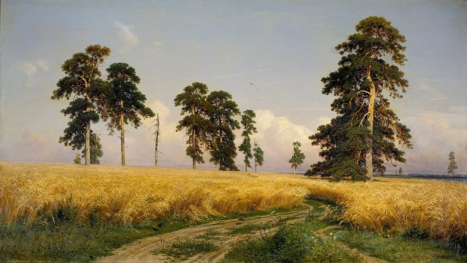 «Рожь» | 1878 | Дорога через поле, группа старых сосен, большое небо |
| 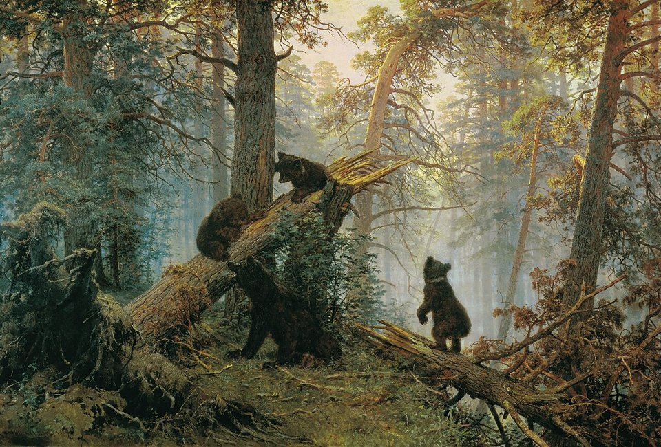 «Утро в сосновом лесу» | 1889 | Лесной воздух, лучи в дымке, бурелом |
| 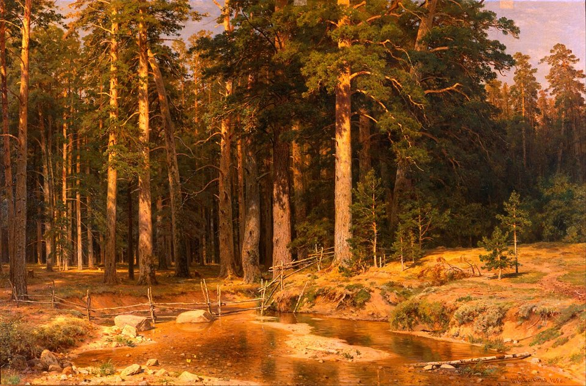 «Корабельная роща» | 1898 | Рыжие стволы сосен в вечернем солнце, ручей, изгородь |
| 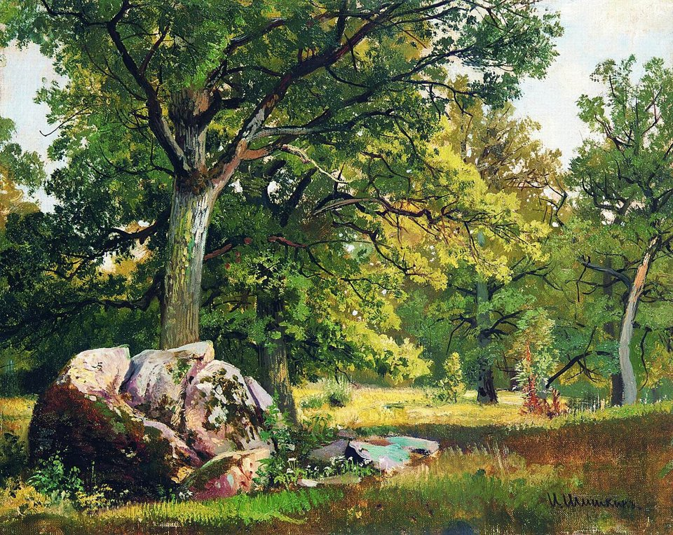 «Солнечный день. Дубы» | до 1891 | Свет и тень в листве, валуны с лишайником |
| 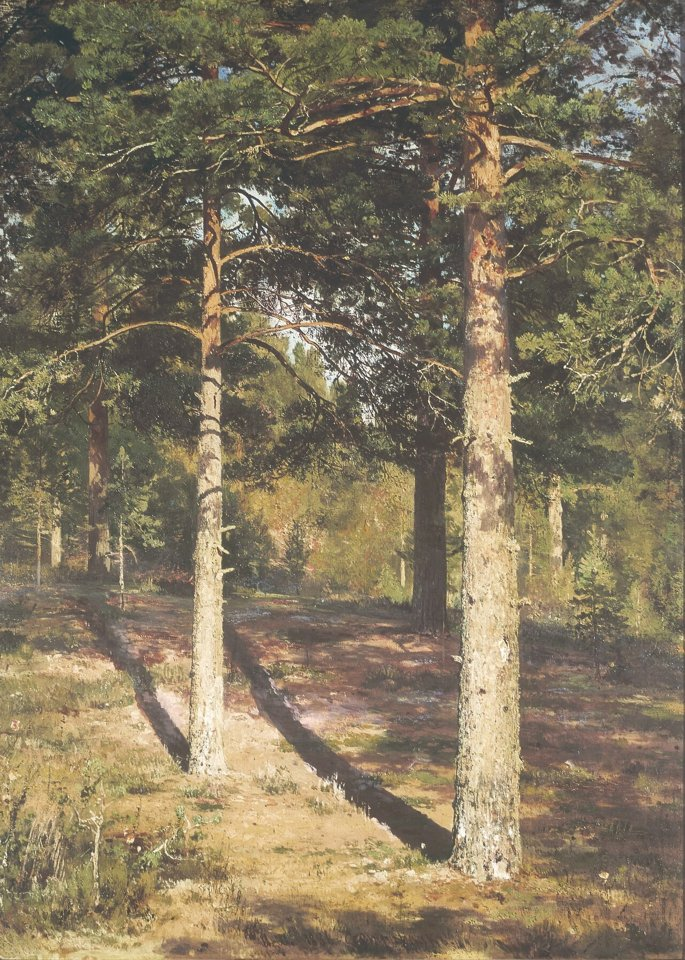 «Сосны, освещённые солнцем» | 1886 | Длинные тени на подстилке, тёплая земля бора |
| 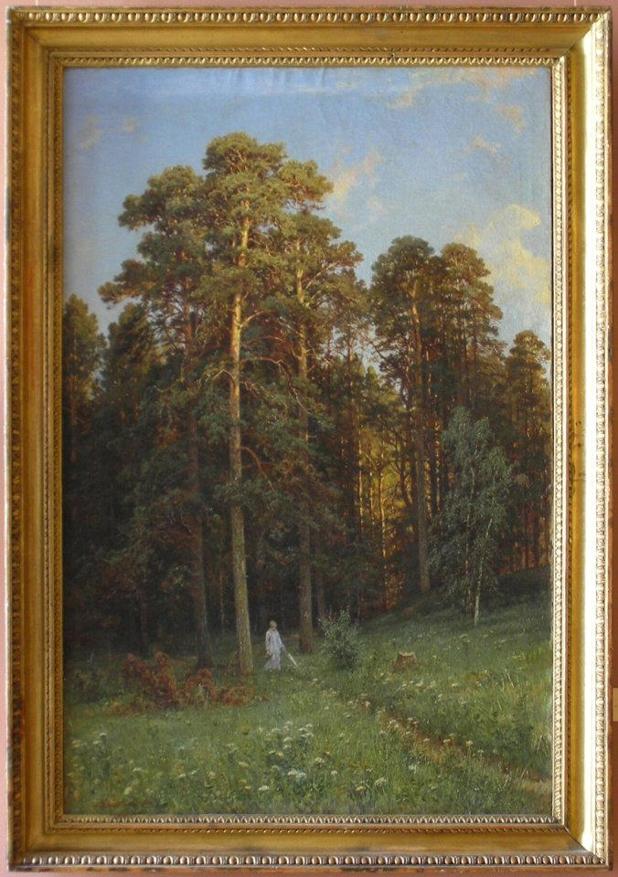 «Опушка соснового леса» | 1882 | Опушка: сосны над лугом, берёза сбоку |
| 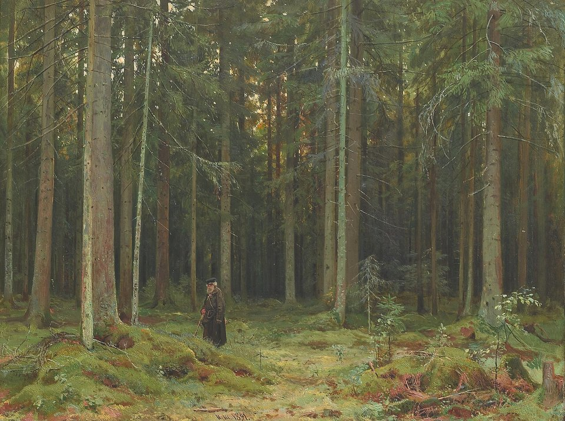 «В лесу графини Мордвиновой» | 1891 | Ельник изнутри: стволы, мшистые кочки |
| 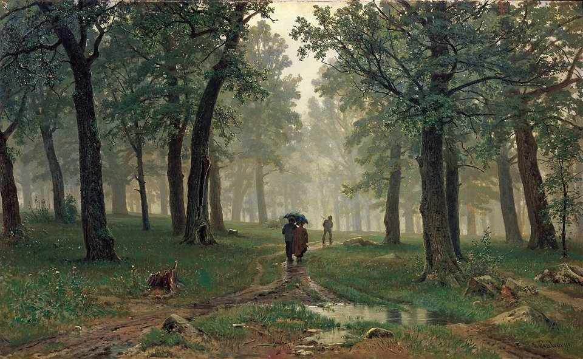 «Дождь в дубовом лесу» | 1891 | Погода: сырость, дымка, лужи на дороге |
| 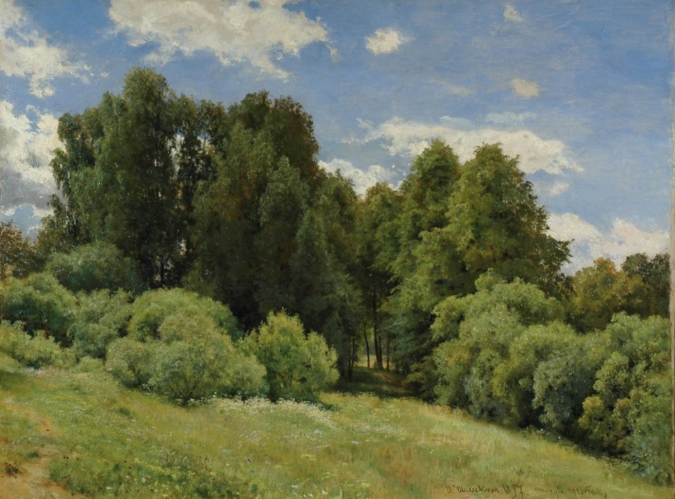 «Поляна» | 1897 | Лиственная опушка, кучевые облака |
| 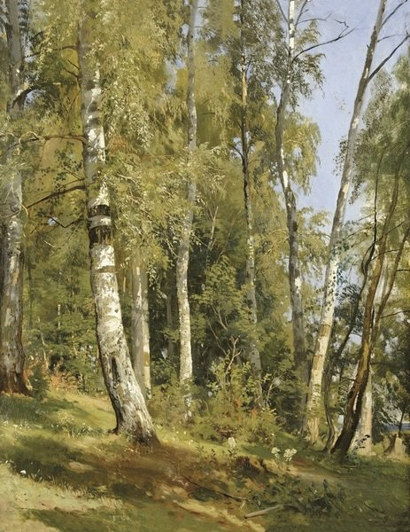 «Берёзовая роща» | 1871 | Берёзы: стволы серые и тёмные, листва охристая |
| 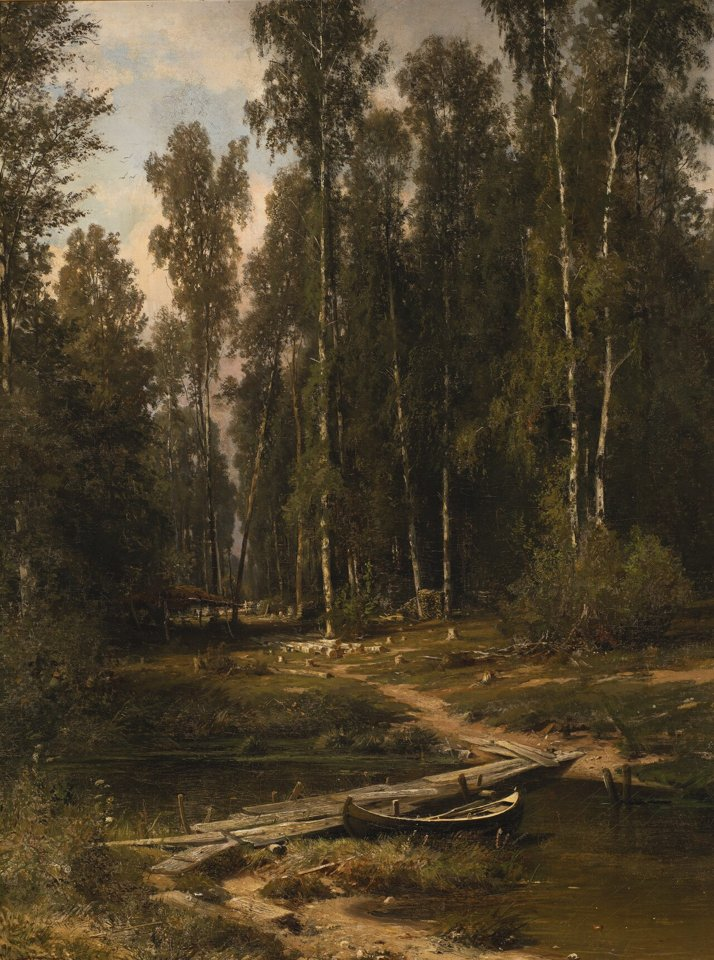 «На опушке берёзовой рощи» | 1871 | Берёзы в тени, тропинка, мостки |
| 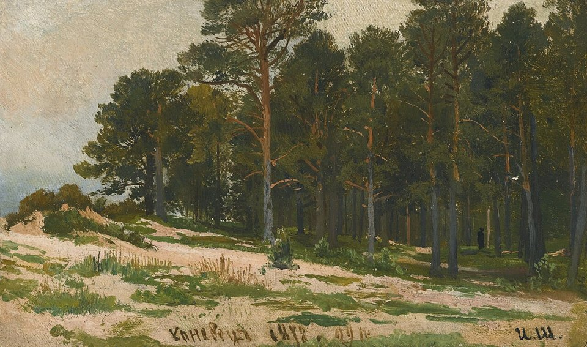 «Сосновый бор» | 1872 | Бор днём |
| 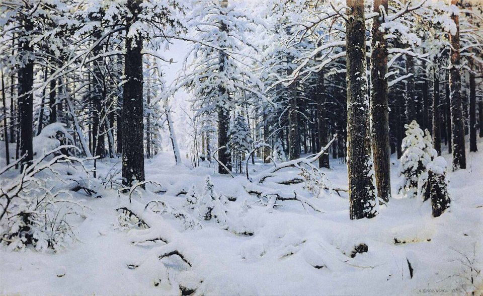 «Зима» | 1890 | Снег на лапах и валежнике, голубые тени |
| 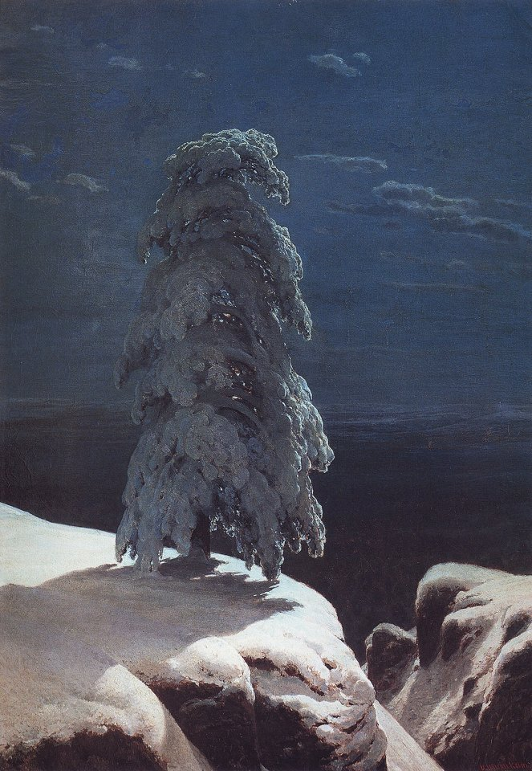 «На севере диком» | 1891 | Одинокая сосна в снегу |

## Как считали

Скрипт снимает с картины и с кадра игры одни и те же числа: яркость (5-й, 50-й и 95-й перцентили), среднюю насыщенность, оттенок и насыщенность листвы на свету (верхние 30 % по яркости среди зелёных пикселей) и в тени (нижние 30 %), долю тёплых земляных тонов (оттенок 10–45°), цвет неба.

Оговорка. Старый лак желтеет, репродукции часто теплее оригинала, поэтому часть сдвига в охру — от времени, а не от художника. Сдвиг переносим не целиком.

## Цифры

| | Яркость p5 / p50 / p95 | Листва на свету | Листва в тени | Тёплые тона | Небо |
|---|---|---|---|---|---|
| «Рожь» | 0.15 / 0.59 / 0.74 | #766f3e, 51° | #2d2e15, 60° | 37 % | #9da3a8 |
| «Утро в сосновом лесу» | 0.10 / 0.34 / 0.69 | #8d8c6c, 54° | #1f261b, 103° | 27 % | #7b9397 |
| «Дубы» | 0.11 / 0.37 / 0.89 | #9ea358, 62° | #2e3d29, 113° | 11 % | #dde4e7 |
| «Сосны, освещённые солнцем» | 0.28 / 0.44 / 0.78 | #9e9569, 49° | #595849, 53° | 45 % | #9ba5ac |
| «В лесу графини Мордвиновой» | 0.25 / 0.36 / 0.55 | #828255, 60° | #4b4b3b, 64° | 17 % | — |
| «Дождь в дубовом лесу» | 0.13 / 0.31 / 0.63 | #8d8b6e, 54° | #333c2e, 96° | 18 % | — |
| «Поляна» | 0.14 / 0.46 / 0.71 | #8b8b4f, 60° | #2b2f1a, 70° | 1 % | #7f93a6 |
| «Берёзовая роща» | 0.24 / 0.47 / 0.78 | #a89f6a, 51° | #534f2e, 54° | 10 % | #bfc6d4 |
| **Мы, ельник** | 0.19 / 0.35 / 0.77 | #88a655, 81° | #14392d, **162°** | **0 %** | #85a8ce |
| **Мы, поля** | 0.31 / 0.56 / 0.78 | #94b05c, 80° | #556d45, 96° | **0 %** | #85acd3 |
| **Мы, бор** | 0.19 / 0.37 / 0.74 | #79ac4b, 92° | #1b3931, **167°** | 3 % | #82a4c9 |

Наши кадры для сравнения: 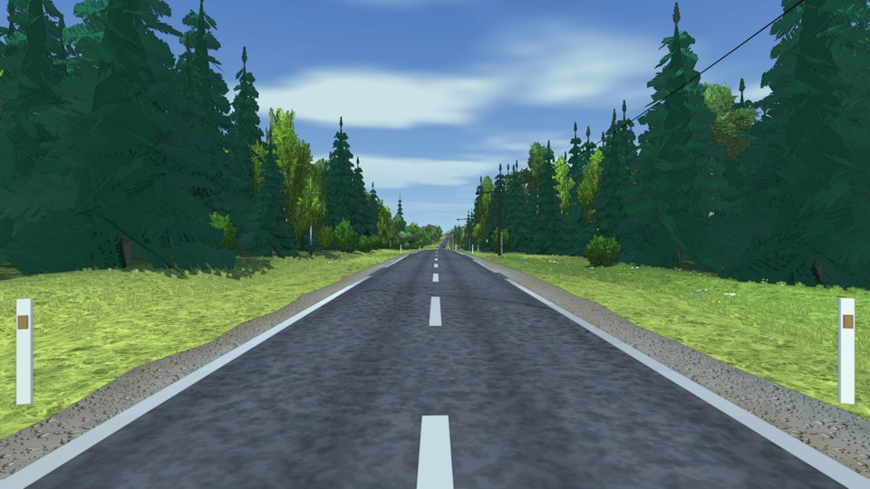 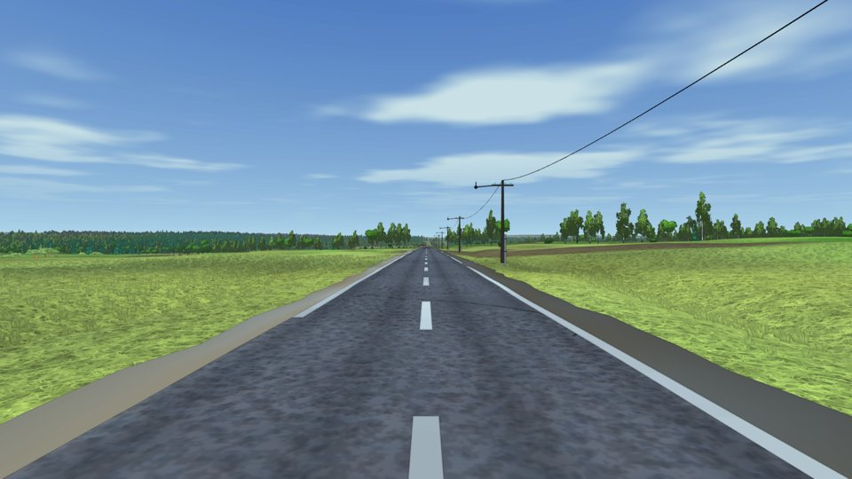

## Что из этого следует

1. **Зелень у Шишкина оливковая, а не изумрудная.** Освещённая листва лежит в оттенках 50–65° (олива, охра, жёлто-зелёный). У нас 80–92°. Даже с поправкой на лак нашу зелень надо сдвинуть на 10–15° к охре и чуть приглушить.
2. **Тень у него тёплая, у нас бирюзовая.** Это самое большое расхождение. У Шишкина тень в листве — тёмная олива или бурая зелень (55–100°, насыщенность 0.2–0.45). У нас хвоя в тени уходит в бирюзу (160–167°) при насыщенности 0.65, и отсюда «пластик»: такой цвет не бывает ни на картине, ни в лесу. Источник — палитра ели и сосны (`0x3f7a60`, `0x34664f`, `0x3e6d5a`) и холодная подкраска тени.
3. **У него в кадре есть земля, у нас нет.** Тёплые тона (охра, рыжие стволы, песок, тропинки, сухая хвоя) занимают у Шишкина 10–45 % картины, у нас около нуля. Мир у нас целиком зелёный. Нужны тёплая подстилка в борах, рыжие стволы сосен, дороги и тропинки, песок, пни.
4. **Небо бледнее и серее.** У Шишкина небо серо-голубое, с тёплой дымкой у горизонта и большими кучевыми облаками. Наше небо насыщенно-голубое, как в игре, а не как в живописи.
5. **Контраст похожий, но распределён иначе.** Медианы яркости у нас такие же. Разница в том, что у Шишкина ярко освещённые пятна (поляна, стволы, тропинка) стоят рядом с глубокой тёплой тенью, а у нас свет ровный.

## Приёмы, которые видны на картинах

- **Свет как сюжет.** Солнце низкое и тёплое. Освещённые стволы сосен горят оранжевым («Корабельная роща»), на подстилке лежат длинные тени («Сосны, освещённые солнцем»), в глубине леса светлый воздух с лучами («Утро»).
- **Сосна — это рыжий голый ствол и крона наверху.** Крона собрана в несколько плоских горизонтальных масс, с кривыми сучьями. У отдельно стоящей в поле сосны крона ниже и шире («Рожь»).
- **Берёза не белая.** Ствол серо-кремовый с тёмными пятнами, внизу почти чёрный; листва охристо-зелёная, светлая, прозрачная.
- **Ель — тёмная вертикаль с опущенными лапами.** Внутри ельника видны стволы, а земля — мшистые кочки, валежник, редкая поросль («В лесу графини Мордвиновой»).
- **Земля живая.** Тропинки и колеи, пни, упавшие стволы, валуны с лишайником, зонтичные белые цветы, лужи.
- **Воздух.** Даль и глубина леса светлеют и сереют, силуэты мягчеют. В дождь всё тонет в серо-зелёной дымке.
- **Композиция дороги.** «Рожь» — почти наш кадр: колея через поле, группа старых сосен у дороги, большое небо.
- **Офорты.** Шишкин был сильным офортистом: штриховка пером по форме. Для нашей «щепотки туши» это законный источник, а не чужой комикс.

## План переноса

Порядок — от дешёвого и заметного к дорогому.

1. **Палитра и цветокоррекция.** Сдвинуть зелень к оливе, убрать бирюзу из хвои и из тени, небо сделать серее и теплее у горизонта. Правка палитр (`landcover`, деревья) и лёгкий общий грейдинг в пост-проходе. Проверка — те же числа до и после.
2. **Тёплая земля.** Подстилка бора — песок и сухая хвоя; рыжий верх стволов сосны; колеи и тропинки от дороги в лес и в поле; пни и валежник в лесу.
3. **Свет.** Тёплое солнце пониже, просвет листвы против солнца, светлые пятна на земле под деревьями, лучи в лесной дымке утром и вечером.
4. **Форма сосны.** Длинный голый ствол, крона плоскими массами наверху, кривые сучья.
5. **Небо.** Кучевые облака у горизонта, бледный зенит.
6. **Редкая картина «Рожь».** Группа старых сосен посреди поля у дороги — как редкое событие режиссёра, а не правило.
7. **Тушь как офорт.** Штриховка тени по форме вместо ровной линии.

## Сделано (2026-09-25)

- **Палитра.** Листва, луга, подстилка и даль сдвинуты к оливе; подсветка снизу из фиолетовой стала тёплой земляной; небо серее, горизонт тёплый серо-белый; финальный грейдинг слегка тянет зелень к оливе и гасит бирюзу. Замер после: листва на свету 57–64°, в тени 90–108° (было 80–92° и 160–167°).
- **Небо средней полосы.** Без пустынной пыли и мутного горизонта, дымка слабее, ореол солнца мягче; кучевые облака в шейдере купола.
- **Подлесок.** Папоротник, лещина, рябина, подрост ели и берёзы; в бору можжевельник; кусты на расчищенной полосе у дороги и куртины в лугах.
- **Кора** — текстура по стволу вместо цвета граней.

- **Тёплая земля.** Пни и валежник, бурая подстилка, спокойный луг; грунтовые колеи от дороги в поле и в лес (две колеи, трава посередине).
- **Сосна.** Охра-медь вместо оранжевого, переход через полосу, стволы толще, кроны светлее.

- **Свет.** Широта 56° (низкое солнце, длинные тени), лучи сквозь деревья утром и вечером.
- **«Рожь».** Раз в ~10 км группа старых полевых сосен в поле у дороги.

Отложено: тушь как офорт (штриховка тени) — экранный фильтр на весь кадр легко выглядит дешёвым трюком; вернуться, когда будет ясно, как штриховать по форме, а не по экрану.
