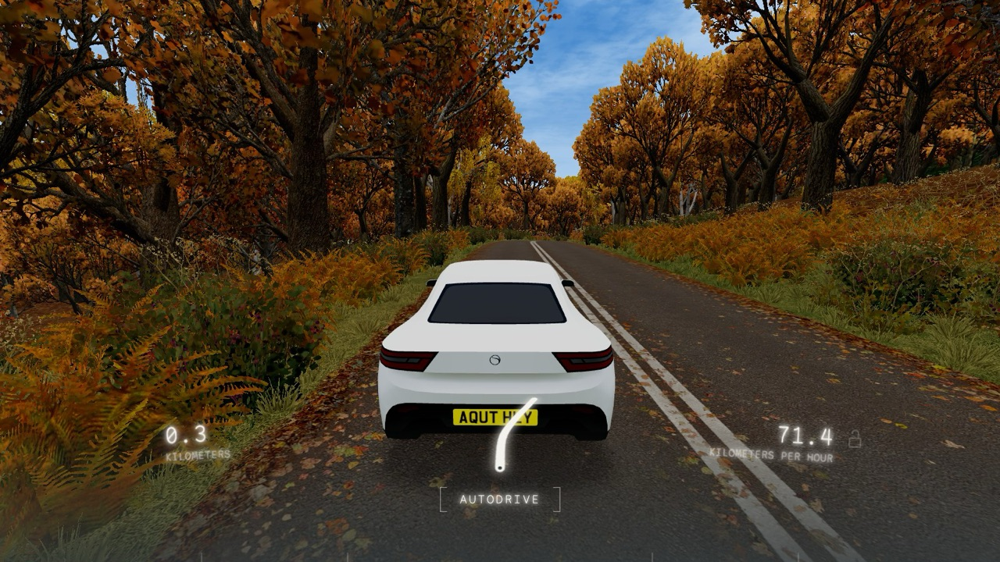
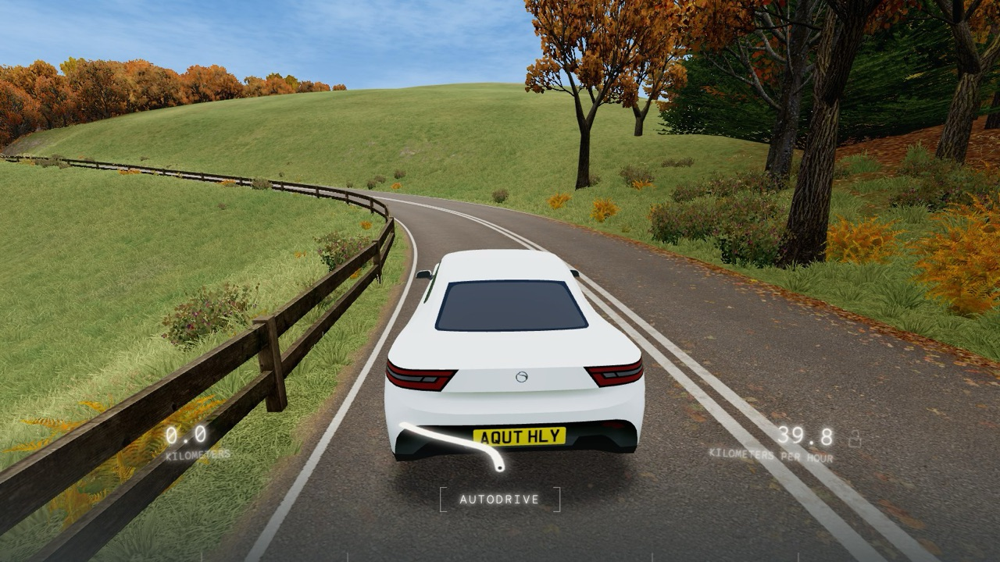
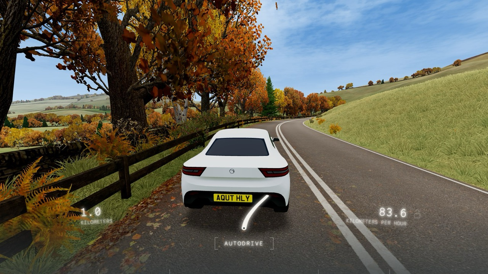
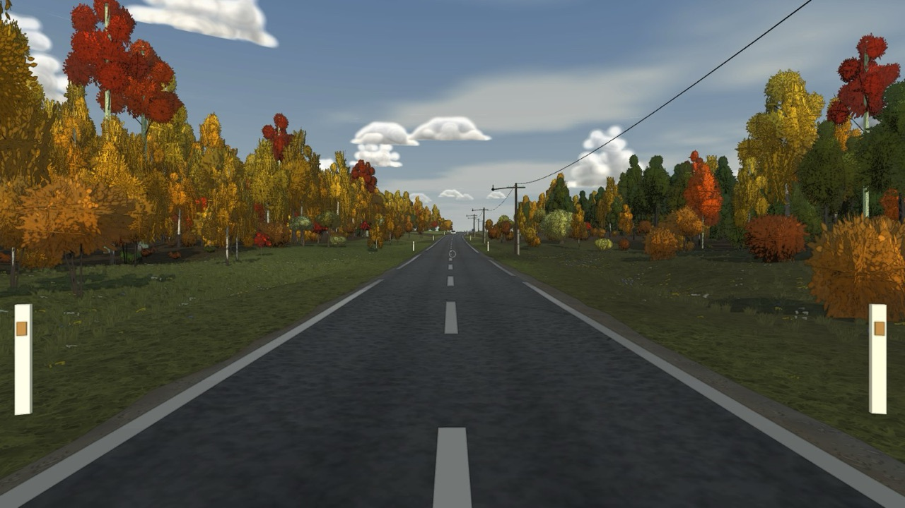
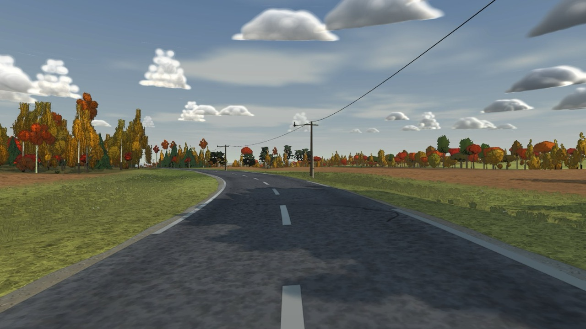
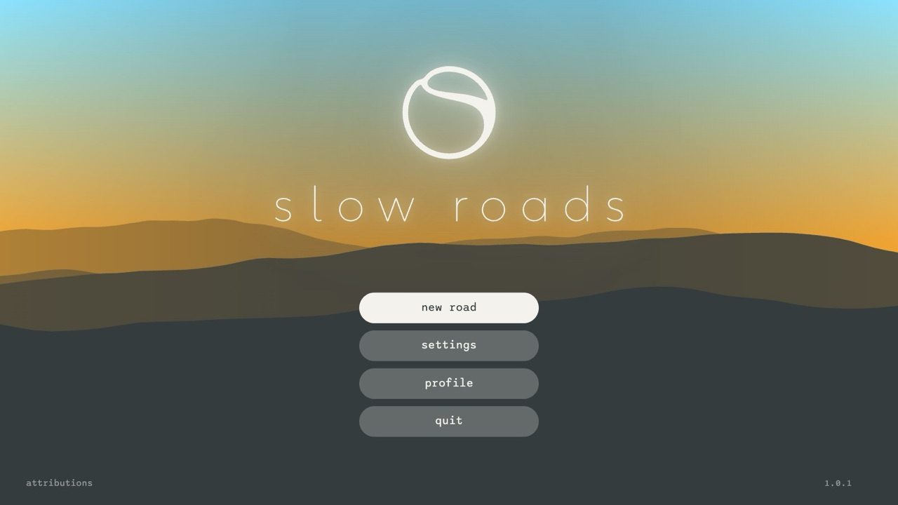
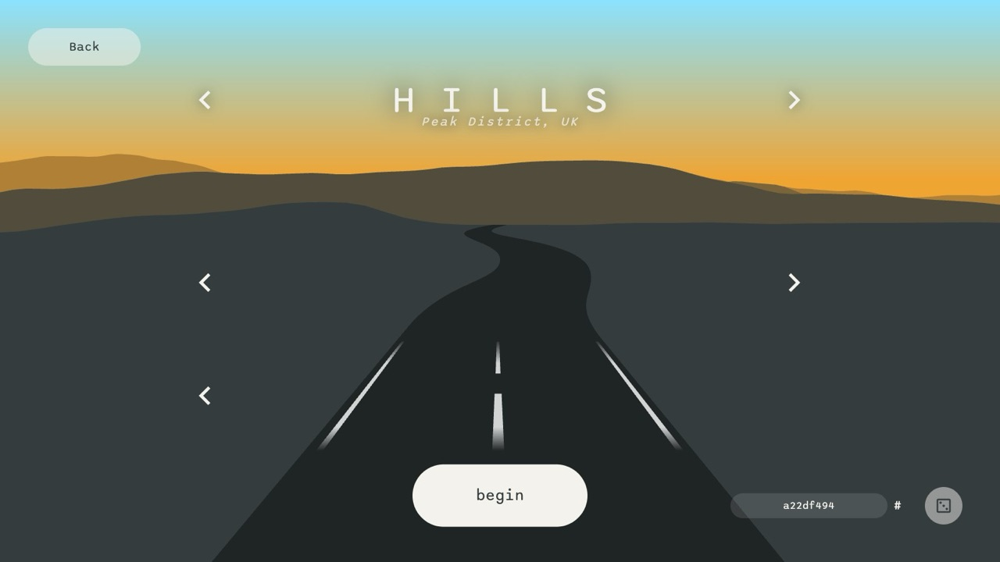

# Разбор slowroads (Steam): из чего сделана картинка

2026-09-26. Владелец дал копию Steam-версии slowroads (`SlowRoadsWindows`, 488 МБ) и решил: изучить её, по разбору составить задание и собрать рендер мира заново. Геймплей (физику, машины, трафик, игрока) не трогаем. Первый разбор, по браузерной версии, лежит в `docs/slowroads.md`. Этот документ его дополняет и местами поправляет.

Лицензия. Код slowroads закрыт (UNLICENSED). Мы берём приёмы, числа и порядок величин, но не код, не текст шейдеров и не ассеты. Черновые заметки по каждой системе с номерами строк лежат в `docs/slowroads-steam/notes/*.md` (на английском). Кадры slowroads в `docs/slowroads-steam/img/` — только ориентир для сравнения, в игру они не идут.

## Как смотрели

- Steam-версия — это Electron. Внутри `resources/app.asar` лежит та же сборка SvelteKit + three.js r155, что и на сайте. Сборку распаковали (`@electron/asar`), 160 тыс. строк JS отформатировали (prettier) и прочитали по системам: земля, трава и кусты, деревья, небо и свет, сезоны, дорога, меню. Каждую систему разбирал отдельный агент, выводы сверены с кадрами.
- Windows не понадобился. Сборка запускается в обычном браузере с локального сервера, без Steam: меню, настройки и езда работают. Сезон, время суток и погода задаются через `localStorage` (`settings_Scene`), качество — через `settings_Graphics`.
- Кадры сняты на Ultra (`viewDistance 4`, `detail 4`), сид `a22df494`, автопилот (F). В том же браузере и с тех же точек, что и наши кадры «до».

Наша игра сейчас, тот же день года (26 сентября), полдень, лес и поле:

## Главный вывод

**Картинку slowroads делают фотографические ассеты плюс несколько дешёвых приёмов в шейдерах.** Физически честного света там нет. Ни одна система не считает честно:

- **Трава земли** — чёрно-белое фото травы 1024², с повтором около 7 м. Цвет дают четыре краски на сезон, смешанные шумами. Светлые кончики травинок берут «светлую» краску, тёмные основания — «тёмную».
- **Листва деревьев** — атласы 4096×1024, отрендеренные с 3D-моделей листьев с фототекстурами, и к ним карта нормалей. Модель дерева — около 150 вершин: ствол и два десятка больших карточек, вырезанных из спрайта целого дерева и спрайтов гроздей.
- **Объём кроны** не нарисован, а подделан. Три множителя: нормаль «капсулы» кроны вместо нормали карточки, затемнение к центру кроны и «сияние» освещённой листвы (множитель на прямой свет).
- **Тени деревьев** запечены в вершины земли: плотность леса гасит прямой свет. Настоящая карта теней есть только вокруг машины, ±4 м.
- **Небо** — это туман. Плоскость на дальней границе, окрашенная трёхцветным туманом. Нет ни солнца, ни рассеяния.
- **Облака** — одна плоскость с двумя слоями шума и параллаксом между ними.
- **Время суток** — не путь солнца, а 4 набора красок (утро, день, вечер, ночь) × 2 погоды (ясно, пасмурно) × 4 сезона. Солнце всегда стоит в зените.
- **Постобработки нет.** Тональная кривая Cineon, MSAA, и всё.

Наш прошлый вывод «картинка держится на атмосфере, а не на ассетах» был неверен. Атмосфера у них дешёвая, но держат картинку текстуры: фото травы, фотолиства, фото лесной подстилки, скал, гравия, асфальта. Всего около 200 текстур webp, 89 МБ.

## Системы по порядку вклада в картинку

### 1. Земля

Подробно: `notes/SrGround.md`.

- **Цвет земли = серое фото × краска.** Краски на сезон: `grassColA/B` для низин и `peakColA/B` для высот. Смесь идёт по шумам с шагом 100 м и 4 км и по карте пятен на 500 и 2000 м. Кончики травинок в текстуре светлые, они тянут к светлой краске; основания тёмные и остаются зелёными. **Это около половины всей картинки.**
- **Многомасштабная деталь.** Затемняющие маски на 100, 500 и 2000 м. Средний масштаб переходит в крупный на 0–800 м, у камеры маска слабее (×0.4). Поэтому дальние склоны читаются как поля и заросли, а не как один цвет.
- **Блеск на скользящем угле («френель»).** Склоны, обращённые к камере, темнее на 25–50 %, склоны под скользящим углом светлее до ×1.35. Отсюда «бархатные холмы». Считается одной строкой.
- **Тень леса в вершинах.** Прямой свет × (1 − плотность леса), рассеянный × 0.75 в полной тени. Под деревьями подмешивается фото лесной подстилки (своё на каждый сезон, осенью — рыжая листва) с рваным краем по шуму.
- **Смешивание по высоте текстуры** (`terrainBlend`). Скала появляется сначала в трещинах, вереск — между травинками, гравий обочины — по светлоте травы.
- **Поля** — случайный оттенок на поле плюс полосы по одной оси. **Скалы** — на склонах круче ~30°, текстура в двух масштабах.
- Сетка: дальние тайлы 240–2500 м с шагом вершин 10–20 м, у дороги ячейки 10 м с шагом 0.5–1 м. Дальние вершины под ближними ячейками утоплены на 20 м.

### 2. Деревья

Подробно: `notes/SrTrees.md`. Самая важная система после земли.

- **Модели.** Лиственные — 135–180 вершин: ствол и около 20 плоских многоугольников кроны, вырезанных из спрайта целого дерева и спрайтов гроздей. Хвойные — 150–260 вершин: пятигранный ствол и 20–25 «мутовок»-вееров со спрайтом ветки сверху. По 4 вида на группу, по 4 варианта, масштаб 1.1–1.8.
- **Атласы.** 4096×1024 на сезон: лиственные (RGBA + карта нормалей, где каждая гроздь — выпуклая полусфера) и хвойные (цвет + отдельная альфа). Столбец 1024 px на вид: спрайт дерева целиком, 2–3 грозди, внизу полоса коры. Листва отрендерена с 3D-листьев с фототекстурами, фон растянут, чтобы не было тёмной каймы.
- **Свет кроны — три множителя:**
  1. Нормаль «капсулы» кроны (радиально ниже 5 м, сферически выше): `clamp(2·dot(L, Nc), 0.25, 1)`. Теневая сторона кроны держит 25 % солнца.
  2. Затемнение к центру: внутри радиуса ~2.8 м полная тень, до 6 м — спад, низ кроны всегда темнее. Внутренние листья получают не больше 50 % солнца, рассеянный свет в ядре ×0.5.
  3. «Сияние»: освещённая зелёная листва получает прибавку `прямой свет × (rg·8, 0.5) × radiance`, то есть насыщенный жёлто-зелёный пересвет на солнечной стороне. Тень остаётся тёмной — отсюда яркий край и тёмное нутро, как на фото.
  - Поверх — нормаль из карты, у каждой грозди свой объём внутри общей сферы.
  - Ни просвечивания, ни настоящего AO, ни wrap-света нет.
- **Хвойные.** Нормаль конуса, затемнение к оси до 65 %, солнце в квадрате: тёмное ядро и светлые концы лап.
- **Пятна леса.** Шум с периодом ~256 м сдвигает R и G листвы: лес пятнами темнее-синее и светлее-желтее, осенью — рыжее и бурее.
- **«Открытки».** 16 ракурсов × 4 варианта по 256² на атлас 4096×1024. Цвет и нормали вида запечены. Соседние ракурсы и модель с открыткой меняются **растворением по шуму** в полосе ~75 м, без смешивания и сортировки. Модели — до 130–280 м (по качеству), открытки — до дальности видимости (до 5 км). За 200–1000 м открытка растёт на 30 % и утопает на 4 м.
- **Расстановка.** Плотность — шум, квантованный до 0–3 деревьев на квадрат 10×10 м по таблицам смещений. Отдельный шум делит лес на чистые массивы лиственных и хвойных. Шум с шагом 1–2 км выбирает, какой вид преобладает (берёзовые рощи, ельники).
- Ветра нет. Тени деревья не отбрасывают и не принимают.

### 3. Небо, туман, свет

Подробно: `notes/SrSkyLight.md`.

- **Туман из трёх цветов на все материалы:** A — горизонт, B — зенит, C — дымка. По порядку:
  1. обесцвечивание по d/дальность;
  2. уход в цвет дымки по (d/дальность)²;
  3. туман к градиенту A→B по высоте над горизонтом (зенит к 30°).
- Расстояние цилиндрическое, от камеры. В ясный день тумана нет до 80–90 % дальности, дальше — резкий EXP2. Отсюда чёткий средний план и мягкая полоса у горизонта.
- **Низкая дымка** с шумной высотой: туман в долинах по утрам. С отрицательной высотой — «вершины в облаках» в пасмурность.
- **Небо** — плоскость на дальней границе, окрашенная туманом до 100 %. Солнца нет. Закат передают только цвета горизонта, облаков и дымки.
- **Облака** — изогнутая плоскость у камеры. Два слоя шума на разных виртуальных высотах с настоящим параллаксом и третья, сдвинутая выборка для теней. Цвета света и тени облака берутся из набора красок: розово-оранжевый низ облака на закате — просто розовая «тень».
- **Свет:** направленный (всегда сверху), рассеянный и полусферический. У каждого набора свои цвет, сила, `fresnel` и `radiance`. Под пологом рассеянный свет тянется к зелёному.
- **Звёзды** — 4000 точек, цвет — зенит плюс блеск, гаснут к горизонту.
- **Тональная кривая** Cineon, экспозиция 1. Постобработки нет. Фонари и фары при ней «светятся» аддитивными спрайтами.

### 4. Трава и кусты

Подробно: `notes/SrGrass.md`.

- **3D-трава только в полосе вдоль дороги,** 16–28 м по качеству. Дальше трава — это только текстура земли. Гуще и выше у обочины, наружу редеет. У самого асфальта — короткие пучки.
- **Пучок** — две скрещённые карточки из серого атласа 1024×256 на 4 вида. Цвет пучка — **та же функция краски, что у земли**, посчитанная в точке его корня. Освещается нормалью земли, поэтому на земле не видно, где кончается пучок.
- **Вдали** пучки не растворяются, а **утопают в землю** на 0.5 м и схлопываются. Края не видно, потому что земля нарисована той же травой.
- **Кусты** — маленькая модель из плоскостей и атлас 2048×512 на сезон с 4 слотами: куст, зонтичные цветы, папоротник, дрок. Смысл слотов одинаковый во всех сезонах. Кусты растут у стенок, на опушках и в 5 м от дороги.
- Ветра нет. На Low трава и кусты выключены.

### 5. Сезоны и погода

Подробно: `notes/SrSeasons.md`.

- Сезон — это смена примерно 10 текстур, 5 красок и 3 веток в шейдерах, а не отдельные системы. Смена мгновенная.
- **Погода — только краски.** Нет дождя, мокрой дороги и луж. Снег — точки, только в пасмурную зиму. Мокрая дорога, дождь и непрерывные сутки — **наши преимущества**, их оставляем.
- Осенью и весной на дорогу под деревьями ложится слой листвы или мха (одна выборка текстуры по тени у дороги).

### 6. Дорога

Подробно: `notes/SrRoad.md`.

- Полоса из 2 вершин на узел без выпуклости. Край асфальта рваный: альфа текстуры плюс alphaTest 0.75. Под асфальтом лежит терраса земли на уровне дороги с гравием, которая переходит в рельеф за 6–16 м.
- «Френель» темнит дорогу у камеры и осветляет вдали. Сплошная разметка ставится по видимости: повороты, лес, гребни.
- Ограждения и стенки — процедурные профили вдоль оси с наклонными концами.
- Ночью светит один прожектор фар с проекционной текстурой ближнего и дальнего света.

### 7. Меню и настройки

Подробно: `notes/SrUI.md`.

- Меню — рисунок по дизайн-токенам: тёмная графитовая основа, «таблетки»-кнопки, моноширинный Sono (заголовки, кнопки, цифры) и гротеск Space (подписи), мягкие тени, фон — стилизованные холмы на закатном градиенте.
- Настройки по схемам, у каждой категории свой ключ в `localStorage` со слиянием поверх значений по умолчанию.
- Качество задают две оси:
  - дальность — 6 ступеней, 360 м … 5 км;
  - детализация — 5 ступеней: трава, тени, туман.
  - Отдельно масштаб рендера 0.5–2×.
- Первый запуск, загрузка с прогревом шейдеров, пауза с замороженным кадром под матовым стеклом. Звуки интерфейса на каждое действие, эмбиент по биому, свой музыкальный плеер.

## Что это значит для нас

1. **Снять запрет на фото-ассеты** (владелец согласился, 2026-09-26). Трава, подстилка, скалы, гравий, асфальт — фотографические текстуры CC0 (Poly Haven, ambientCG), серые и подкрашенные в шейдере. Листва — атласы, отрендеренные в Blender (5.2 есть на этой машине) с листьев CC0. Свой вид даёт палитра, формы, свет и наши виды деревьев (берёза, осина, ель, сосна, дуб, липа), а не рисованные текстуры.
2. **Свет — приёмы slowroads, а не честная физика.** Краска по шумам, «френель» земли, запечённая тень леса, три множителя кроны, трёхцветный туман. Это дёшево и держит картинку.
3. **Тени.** Настоящая карта теней — только машина и ближний план. Лес затеняет землю через вершины. Это ещё и снимает самую дорогую часть нашего кадра.
4. **Трава только у дороги,** утопание вместо растворения.
5. **Сохраняем своё:**
   - непрерывные сутки с настоящим солнцем, луной и звёздами (у slowroads сутки — 4 снимка);
   - дождь и мокрую дорогу;
   - сезон, который меняется с расстоянием;
   - физику и машины.
   Набор красок сезон × время × погода интерполируем, а не переключаем.
6. **Облака.** Владелец выбрал живые объёмные облака (вариант А). Первая реализация (ветка `wip/volumetric-clouds`) стоит 5–8 мс и пока мягкая. Её доводим в рамках нового неба до бюджета. Приём slowroads (плоскость с параллаксом, вписанная в туман) оставляем как запасной вариант для слабых машин.

Задание на новый рендер: `docs/renderer-v2.md`.
