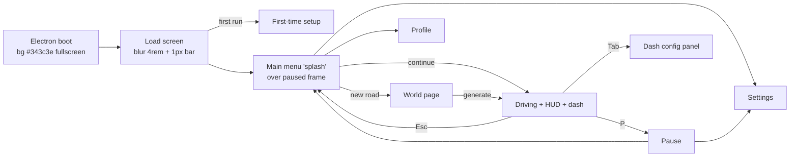

# SrUI.md

## Summary

I read slowroads' whole UI, settings, camera, audio and Steam layer from the pretty JS, the Electron main/preload, index.html and the CSS. The report below is ordered by how much each part affects the look. It covers the design tokens and components with exact numbers, every settings schema with options and defaults, what each graphics tier changes (full tables), the camera modes and FOV-effect math, the loading, intro and pause flow with timings, the UI sounds and ambience per biome, the music player and radio, persistence (localStorage keys and the .roads profile file), and Steam (appid, DLC, stats). Two gaps: the CSS file is one 91.7 KB line and my tools could only read the first 50 KB and the last ~20 KB, so about 20 KB in the middle (dash buttons, HUD stats, now-playing, music modal) is described from the JS markup and class names only. The topo_square PNGs are alpha-only and showed as solid black, so their content is inferred.

## Architecture

slowroads UI = SvelteKit single route '/' (node 2 → chunks/2.7f7e25dd.js) layered over one three.js canvas. #main contains .canvas-container (canvas) + #ui-fixed (z 100) with: load-bar/intro-backing, HUD (dash-display-panel), dash bar + config body, prompts, pause overlay, full-screen menu pages (splash Main / World / Settings / Profile) switched by store Ei (xt.Main/World/Settings/Profile) and hn (showMenu). Opening any menu pauses the ticker (Ht.pause) so the frozen frame sits behind frosted overlays. Settings are schema-driven: each category is a store class `ni(name, defaults, validate, sanitize)` with per-key listeners; a parallel UI schema object (labelKey/enumKey/descKey/type Boolean|Enum|Range|Selection, min/max/step/precision, enables/overrides/hideForTouchscreen) auto-renders rows and assigns uiIndex for gamepad nav. SettingsManager (yi) writes each category to localStorage `settings_<Cat>` on change and debounces (5 s) a full profile JSON {version, ts, settings, profile, vehicles} to Electron userData/profiles/profile.roads (tmp+rename) plus localStorage `liveProfile`. Navigation: a context stack Fe with uiUp/Down/Next/Prev/A/B/Menu handlers shared by keyboard, gamepad and mouse; every nav action fires a UI sound through a dedicated WebAudio graph (uiGain, menuGain with fade → master → DynamicsCompressor). Game audio (ambience/wind) is keyed by scene style (location × season × time × weather) and crossfaded by speed. Steam via steamworks.js in Electron main: subscription gate, language, Steam Deck, supporter DLC, integer km stats pushed when they increase.

## Files

- /tmp/slowroads/app/build/index.html: Design tokens (:root --sr-* colours with alpha variants, fonts Sono/Space/Noto…), font-face list, root font-size breakpoints, gamepad/Logitech POV proxy, global cursor:none, slashed-zero
- /tmp/slowroads/app/build/_app/immutable/assets/2.ae798a5b.css: All route-'/' component CSS: settings list/rows/enum/bool/slider, settings tabs, profile, world-config (new road), first-time setup, splash menu + intro animation, dash (conf-*, dash-*), vehicle config, prompts, pause, error, load-bar, intro-backing, freecam menu, HWA warning
- /tmp/slowroads/pretty/mainmangled.js: Electron main: steamworks init APP_ID 3431300, DLC 5080840, window (fullscreen, bg #343c3e), F11/Alt+Enter, IPC for profiles (.roads), music folder scan via music-metadata, radio-streams.json, Steam stats/achievements
- /tmp/slowroads/pretty/preload.js: window.api bridge (isSteamDeck/isSupporter/hasDemoFile, save/load/export/import profile, music dir/list, radio list, stats)
- /tmp/slowroads/pretty/chunks/normals.f63d4883.js: Settings store class (21337, 21573 storageKey), Audio schema (21430-21560), camera presets Ze (23975-24050), Gameplay schema Tt/ri (24117-24330), Camera store (26074), English strings Ai (26332-26990), Graphics schema Bt/Qi (34455-34641), keyboard defaults sf/In/Zi (34677-34810), profile stats + Steam stat push (34950-35050), version/changelog (35046-35140), in-car dash canvas (37560-38130), frame limiter (45331, 45474)
- /tmp/slowroads/pretty/chunks/SceneConfigCol.svelte_svelte_type_style_lang.0ec95a19.js: Hills scene init (sun shadow cam ±4m, lights), ambience/wind mix (updateAudio ~49990), Music store defaults (50196), SettingsManager: localStorage keys, loading-flag guard, first-visit auto tier, 5 s debounced disk save (50252-50480)
- /tmp/slowroads/pretty/chunks/HillsHeightmap.b6172a83.js: Graphics tier tables te.graphics.viewDistance[6] / detail[5] (1484-1700), tier applier _l (5607-5660), per-season/time/weather ambience mapping (164-1242, style map 1286), wind speed constants Ns=30 Us=0.6 (5516)
- /tmp/slowroads/pretty/chunks/CaliMidlineGenerator.7dfc1747.js: Coast ambience zones pch_{ocean,hills,desert}_{day,night} (89-140)
- /tmp/slowroads/pretty/chunks/2.7f7e25dd.js: Main route: camera controller ow (728-1470, modes, FOV effect, config-view offset, cinecam), UI sound bank vp + AudioContext hw (1473-1650), music controller mM (8240-8480), renderer init/pixel ratio (8570-8720), world page logic (17960-18060), splash menu (21200-21720), HUD k411d (24170-25480), dash selects (25640), vehicle config (29140), music modal (29730-31600), dash bar Ik (32033-32640), pause Vk (33180-33330), load/intro screen (34160-34950), intro timing (35140-35190)
- /tmp/slowroads/app/build/audio/: UI sounds (ui_tone_*, ui_tick_*, ui_pip*, ui_next/prev, ui_dash_open/close, ui_confirm, ui_negative, ui_click*.wav, btn_01, achievement), menu loops menu_backing_hills*.mp3 / offworld, drone_01
- /tmp/slowroads/app/build/img/: 24×24 white filled SVG icon set (ico_*), road/lane illustration SVGs for world page, logo-stacked-white.svg, topo_square*.png contour patterns
- src/game/settings.ts: OUR current settings persistence (single SETTINGS_KEY in localStorage) — target for adopting the per-category schema pattern

# slowroads: menus, settings, HUD, camera, audio, UX (Steam build 1.0.1)

Paths are relative to `/tmp/slowroads/pretty/` unless absolute. The CSS is `/tmp/slowroads/app/build/_app/immutable/assets/2.ae798a5b.css`, one minified line. I could read its first 50 KB and its last ~20 KB. The ~20 KB in between (dash buttons, HUD `stat-*`, `np-*`, music modal) is reconstructed from JS markup and is marked [INFERENCE].

---

## 1. Design language: the look

### 1.1 Palette (`index.html` `:root`)

| token | value | role |
|---|---|---|
| `--sr-white` | `#F4F2ED` | warm off-white. All text, active fills, logo, in-car dash text. Also the page `theme-color`. |
| `--sr-primary` | `#343c3e` | dark slate/teal-grey. Backdrops, Electron window background, text on white pills. |
| `--sr-secondary` | `#D2D1CD` | light warm grey (error text) |
| `--sr-tertiary` | `#7e7c76` | warm mid grey (Firefox fallback for frosted panels: `tertiary-90`) |
| `--sr-warn` | `#ff992b` | invalid seed/hash border, seed warning |
| `--sr-black` / `--sr-dark` / `--sr-darker` | `#222` / `#444` / `#333` | rarely used; renderer clear colour is `#444444` (2.7f7e25dd.js 8680 `setClearColor(4473924)`) |

- **Alpha ladder** (the key to the look): each colour has hex-alpha variants `-0 00`, `-10 20` (really 12.5%), `-25 40`, `-50 80`, `-60 90`, `-75 C0`, `-90 E0`. Nearly every surface is white or primary at one of these alphas over a blurred scene.
- Collision/remap warning: `#fb0`. Error toast: `#d00b`. Demo/`dm-*` leaderboard uses plain `#fff4`/`#0004`.

**For us:** copy the *system*, not the hex: one warm off-white, one dark desaturated base, and a fixed 6-step alpha ladder. For central Russia, a warm off-white (birch-bark/linen) plus a dark cool slate-green fits both summer and snow. What matters most: every panel is **translucent + backdrop-blurred** over the live frame. There are no opaque cards.

### 1.2 Typography

- Preloaded: `/fonts/Sono.ttf` and `/fonts/Space.ttf` (`index.html` `<link rel=preload>`).
- `--sr-font-titles: Sono, Noto` is used for titles, buttons, tabs, numbers, HUD and all digits. The in-car canvas uses it too: speed `36px Sono`, odometer `22px Sono`, labels `12px Sono` (normals 37844-37933).
- `--sr-font-body: Space` is the `body` font (`Space, Helvetica, sans-serif`) and is used for setting labels and blurbs.
- Fallbacks: `ZCOOL` and `Noto` both map to NotoSans for CJK/Cyrillic. `Huninn` maps to Inter.
- Plate fonts: `LicensePlate`, `CharlesWright` (UK), `Anta` (off-world). `Quantico` and `RobotoMono` are also bundled.
- `* { font-variant: slashed-zero; word-break: keep-all }` applies globally, and the canvas sets `fontVariantNumeric = "slashed-zero"`.
- Weights are very light: labels 200, blurbs 100–200, buttons 400, only the active option is 500–600.
- Case rules:
  - Section headers, tabs, dash labels, load stage: UPPERCASE.
  - Main-menu words are lowercase (`begin`, `new road`, `continue`, `settings`, `profile`, `quit`, `save and quit`), as is the tagline `endless driving zen`.
  - Profile labels use `text-transform:lowercase`.
- Letter-spacing:
  - Settings body `.05rem`
  - Pause title `.5rem`
  - World location name `2rem` at `3rem` size, with `margin-right:-2rem` to re-centre
  - Error text `.15rem`
- Root size is `16px`, `14px` for landscape ≤1180px, `10px` for portrait ≤1180px. Everything is in rem, so the whole UI scales from one number.

**For us:** pick one rounded monospace-ish display face with Cyrillic, open licence (e.g. a variable rounded mono, or JetBrains Mono / IBM Plex Mono with light weights), and one geometric sans for body. Needed: Cyrillic coverage, slashed zero, and a 200 weight. Numbers in the HUD and settings must use the display face. Keep root-rem scaling.

### 1.3 Shapes, glow, motion

- **Pills everywhere**: `border-radius:100vh` or `2rem`.
  - Button heights: main menu `line-height:min(6vw,6vh)`, generic menu button `3rem`, settings row `min-height:2.5rem`, generate `5rem`, dash select `4rem`.
  - Square tiles (5rem × 5rem) only in the style/option grids (`style-selection-option`, `enum-option`).
- **State language**, consistent everywhere:
  - idle: `white-25`/`white-50` fill, white text
  - hover: `white-50` fill + `box-shadow 0 0 1rem primary-50` (or `white-50`)
  - selected/active: **solid `--sr-white` fill + `--sr-primary` text**
  - keyboard/gamepad focus: `2px solid white-75` ring (rows) or `2px dashed white-50` (dash select), without changing the fill
  - disabled: `opacity .33; pointer-events:none`
- **Glow text**: titles use `text-shadow 0 0 .5rem white`. The selected dash tab stacks four white shadows (`.25/.5/.75/.1rem`). Numbers (`p-val` 2.4rem) have `0 0 1rem white`. Over bright scenes, text gets a dark halo (`0 0 .8rem primary`, pause).
- **Logo glow**: `drop-shadow(0 0 .5rem white-50) drop-shadow(0 0 2rem white-75) drop-shadow(0 0 5rem primary-50)`.
- **Blur levels**:
  - `1rem`: splash overlay, pause, `dm-panel`
  - `2rem`: first-time setup, tooltips, splash intro
  - `4rem`: load screen, settings panel `#ui-settings`, dash body, error, HWA warning
  - `.5rem`: dash select options
- **Durations**:
  - `.1s`: toggles, bool slide, hover
  - `.2s`: canvas width, `#upcoming` opacity
  - `.3s`: dash body open/height, canvas-container position
  - `.33s`: dash fill opacity
  - `.5s`: stat fades (Svelte `fade {duration:500}`)
  - `1s`: pause backdrop + blur transition
  - `5s`: intro backing
  - `1.5s` after `0.5s` delay: splash-intro keyframes, solid primary + `blur(2rem)` → transparent + `blur(0)`
  - Svelte `fade {duration:100}` on the pause panel
- **Cursor**: `body{cursor:none}`. It is shown only on mousemove in menus (2.7f7e25dd.js 21664) and set to `grabbing` while dragging the camera.
- **Topographic texture**: `img/topo_square*.png` (1080²) is used as `background-image` at `background-size:35%` with `background-blend-mode:screen` on the HWA-warning screen. [INFERENCE: alpha-only contour lines; the image reads as solid black.]

**For us:** this is what makes it read as "polished": few components, one state vocabulary, soft glow on type, heavy blur, slow 1–5 s fades on big state changes, and 100 ms micro-feedback. Adopt the durations as-is. A contour or field-map texture (e.g. old Soviet topo-map lines) is a good brand accent for loading and warning screens.

### 1.4 Icons and illustration

- `img/ico_*.svg` are 24×24 viewBox, white filled glyphs (not strokes), sitting at `opacity .5–.75` and going to 1 when selected. Examples: `ico_scene_{spring,summer,autumn,winter}`, `ico_time_{morning,day,evening,night}`, `ico_weather_{clear,overcast}`, traffic density/speed/lane, `ico_veh_*`, music transport, lock, heart, die, folder.
- `img/road_*.svg` (1024×512) are flat road silhouettes receding to a vanishing point. Variants: paved/dirt × straight/casual/normal/winding × narrow, plus lane-paint overlays `road_lane_*`. On the World page they sit behind the pickers: base at `opacity .4`, paint at `.8`, vertically masked (`mask-image` gradient, transparent 34%→black 41–60%→transparent 67%).
- Logo (`logo-stacked-white.svg`, 3020×1546): a round emblem (circle with a winding road swoosh cutting through) over a thin lowercase rounded wordmark "slowroads", filled `#f4f2ed`.

**For us:** one coherent filled 24px glyph set (seasons: birch leaf / sun / maple / snowflake; weather: clear / overcast / rain / fog). Use a road-perspective illustration behind the road-type picker so the choice is legible without text.

---

## 2. Screen flow and menu structure

### 2.1 Electron shell (`mainmangled.js`)

- Window: 1280×800, `fullscreen:true`, `backgroundColor:"#343c3e"` (no white flash), menu bar removed.
- `webPreferences`: `backgroundThrottling:false`, `sandbox:true`, `contextIsolation:true`.
- Switches: `force_high_performance_gpu`, `autoplay-policy=no-user-gesture-required` (menu music plays without a click).
- Keys: F11 or Alt+Enter toggles fullscreen. Ctrl/Cmd+W is swallowed.
- Single-instance lock. Content is served via the custom `app://` scheme; local music is served via `app://music/<path>`.
- `index.html` wraps `navigator.getGamepads` to add POV-hat buttons for Logitech G9xx wheels, and flags `isWheel`.

**For us:** in the browser, set `html{background:#base}` before JS runs, request fullscreen on first user gesture, and gate audio start on first gesture.

### 2.2 Loading screen (2.7f7e25dd.js 34160-34700; CSS `.load-bar*`)

- Full-screen `primary-50` + `blur(4rem)`. `.load-bar-init` uses solid primary before the scene exists.
- Centre column `12rem` wide, `gap .75rem`:
  - `LOADING` (`load-bar-prog`, Sono 1.5rem uppercase, weight 400)
  - a **1px** bar: track `white-25`, fill `white` at `width = progress%`
  - a stage label: uppercase `.8rem`, `white-50`. Values: `Road / Scene / Vehicle / Environment / Compiling shaders` (`loadRoad`, `loadScene`, `loadVehicle`, `loadEnvironment`, `loadShaders`).
- Loading is a job queue (`e0.addJob(fn, weight, label, stage)`, SceneConfigCol 49780-49850). There is an explicit shader precompile/stabilise phase (`precompile {hasScene, hasLights, hasMirrors, hasStabilised, stableCount}`, 2.7f7e25dd.js 8568) so the first frames don't hitch.
- First-run variant (`load-intro`): three centred lines at 1.5rem, weight 200, white glow. Text: "The slow roads are those you take / when the journey matters more / than the destination", with the same 1px bar under it.

**For us:** a 1px bar + one uppercase stage word + a poetic first-run line (Russian, e.g. about the road itself). Precompile all material variants (season/night/fog permutations) behind this screen. This removes the stutter, which matters more than any graphic.

### 2.3 First-run intro choreography (2.7f7e25dd.js 35143-35190)

- Stages enum `nb = {Preload:0, Intro:1, Config:2, Dash:3, Drive:4, Ended:5}` (normals 26317).
- The intro text is shown at least **7 s** (`setTimeout(B, 7e3)`).
- Then `Config` for 4 s. The `intro-backing` layer (primary, blur 4rem, `transition: all 5s`) fades to `primary-50` and later to `primary-0`.
- `Dash` at 4 s, then three callouts appear 500 ms / +1750 / +1750 apart: "Your distance" (odometer, tilted `rotateY(-20deg) rotate(-3deg)`), "The road ahead", and "Your speed" (mirrored tilt). Each has a thin underline bracket.
- `Drive` at 10 s shows "Just drive...".
- `Ended` at 12.5 s sets `hasSeenIntro`.
- Camera is forced to mode 0 (Chase) until the intro has been seen.

**For us:** a 12-second silent onboarding that *points at* the HUD with tilted labels instead of a tutorial popup. Cheap and very high polish.

### 2.4 First-time setup (`ft-*`, 2.7f7e25dd.js; strings `firstTime*`, `setup*`)

- Modal `width:max(25rem,min(34rem,50vw))`, `rgba(0,0,0,.2)`, radius 2rem, over solid primary + blur 2rem.
- Rows: Language, "Using wheel controller?", Music folder, "Import settings/distance from demo?", plus a legal line and a `continue` pill (`line-height 3.5rem`).
- The footer says "These can be changed at any time in the settings".

### 2.5 Main menu "splash" (2.7f7e25dd.js 21200-21720; CSS `#splash*`)

- **Backdrop**: the paused live frame, then `#splash-bg-overlay` (`primary-50`, `blur(1rem)`), then `#splash-bg-column` (horizontal gradient `primary-0 → primary-25 → primary-25 → primary-0`, which darkens only the centre column).
- `#splash-centered`: square `90vh`, flex column, gap 2rem.
  - Logo wrap `max-height 40vh` with the glow above.
  - Subtitle `endless driving zen` at `min(2.5vw,2.5vh)`, `white-50`, weight 300.
  - Buttons column `width 25%` (`min 16rem`, `max 24rem`), gap `1.5vh`.
- Buttons in order: `continue` (only if a saved road exists), `new road`, `settings`, `profile`, `quit`. It becomes `save and quit` when a drive is in progress.
- Button style: Sono 1rem, `white-25` fill, blur 1rem, pill. Hover `white-50` + shadow. Focus solid white with primary text.
- Corner meta buttons (`splash-meta-button`, fixed bottom, `.8rem` lowercase `white-50`, 2px transparent border that becomes `white-50` on focus): attributions (left), supporter with a glowing heart (left 10rem, supporter DLC only), version/changelog (right). A "New version" tag sits over the changelog button.
- Changelog and attributions open in `.splash-scrollable` (`#0004` + blur 1rem, content width `min(50vw,50rem)`).
- Nav: up/down wrap and skip `continue` if absent. Left/right move to the meta buttons. A = click + `confirm`. B = back + `negative`. `Me.up()`/`Me.down()` play `ui_tone_07b` on each move.
- Menu music: `Me.beginMenu()` starts `menu_backing_hills_05.mp3` looped (first start fades in over **3 s**). Leaving the menu fades out over **2 s** and stores the loop offset. Returning resumes from that offset with a **1 s** fade.

**For us:** the menu is *just the game, paused and blurred* with a darkened centre column. No separate menu scene. Keep the lowercase single-word buttons and the soft ambient loop that resumes where it left off.

### 2.6 World page, i.e. "new road" (CSS `.world-*`, `.generate`; logic 2.7f7e25dd.js 17960-18060)

- Centred column `min 52rem` / `max 64rem`, height 100vh. Rows:
  1. **Location**: name in 3rem uppercase, letter-spacing 2rem, with an italic subtitle (e.g. `Hills` / "Peak District, UK", `Coast` / "California, USA", `Off-World` / "Solar System"). Big 5rem round arrow hit areas (each half of the row is a click box). Pips underneath (1rem × .2rem bars; the selected one is `white-75`).
  2. **Road style**: Straight / Casual / Normal / Winding (Mixed exists).
  3. **Lane style**: Off-road Wide / Off-road / Single-track Wide / Single-track / Standard / Two-lane / Three-lane / Four-lane.
  4. **generate**: white pill, 1.25rem, `line-height 5rem`. Disabled shows as outline `white-75`.
- Bottom-right `world-numbers`: Seed, Distance (start km), Code (shareable hash), shown as `world-input` pills with round 3rem icon buttons (randomise die, reset).
- Bottom-left `continue`.
- Generate plays `btn_01.mp3` ("gong") and closes the menu. The Menu element plays `negative`, Randomise/Reset play `confirm`.
- Coast forbids road style index 0. Off-world allows only the first two lane styles.

**For us:** a region picker (e.g. "Средняя полоса / Тверская обл.") with the huge letter-spaced name + italic subtitle, a road type picker (gravel, patched asphalt, concrete slabs, two-lane) over the road silhouette illustration, and a shareable seed code. This screen sells the fantasy.

### 2.7 Pause (2.7f7e25dd.js 33180-33330; CSS `.paused*`)

- Overlay `primary-50` + `blur(1rem)`, `transition: backdrop-filter 1s, background 1s`, `text-shadow 0 0 .8rem primary`.
- Title "Paused", 1.4rem, letter-spacing .5rem.
- Three stacked full-width pills: Resume / Settings / Main Menu. Style: `white-25`, `.8rem 2rem` padding, shadow `0 0 1rem primary-25`. Focus `white-75` + primary text.
- Bottom stats row (`.85rem`, weight 100, `white-50`): session distance (`km` with 2 decimals) and time.
- Esc = Menu (back to splash). P = Pause.
- `pauseOnMenu` defaults to true. `pauseOnUnfocus` defaults to false (window blur pauses only if enabled).

### 2.8 Settings page (CSS `.settings-*`, `.setting-*`; schemas in normals)

- Full screen. Top tab row (Sono pills, `min-width 5rem`, `line-height 3rem`, gap 2rem, `padding-top 5vh`, bottom hairline `white-25`).
- Tabs: **Gameplay · Graphics · Controls · Audio · System**. The active tab is `white-50` with primary text. A Back pill sits at left `5vh`. A Return pill is fixed bottom-right.
- Controls has sub-tabs Keyboard / Controller / Mouse, each split into Settings / Mapping. Sub-tabs are separated by a 2rem hairline, and the focus ring wraps the whole sub-tab group.
- Column `width 40%` (`min 640px`, `max 800px`). Sections have a gap of 2rem.
- **Section header**: uppercase Sono 1rem pill on `white-10`, with a small "Reset" link at the right (`.8rem`, `white-50`).
- **Row**: pill, `min-height 2.5rem`. Label `flex-basis 55%`, `.9rem`, weight 200. Control `40%`.
- **Tooltip** (desc): a gradient pill `white-10 → white-0` that slides out to the *left* of the row (`right:100%`, width 18rem, `.8rem`, weight 200).
- **Controls**:
  - Enum: white pill (primary text) with invisible left/right halves to step; arrow icons at `opacity .6`.
  - Bool: 60%-wide track `white-25`; the fill (60% width) slides from left 0 to left 40% in `.1s` and shows ON/OFF uppercase `.8rem`.
  - Range: `.5rem` track split into left (value) and right parts with a 1rem round white handle, and an editable numeric value above (Sono `.8rem`).
  - Mapping: white pill with a rotated "+" delete button. Collision warning in `#fb0` to the right.
- Schema-driven. Each field has `labelKey / enumKey / descKey / type / min / max / step / precision`. `enables:[...]` greys out dependants and `overrides:[...]` disables others. `hideForTouchscreen` and `secret` flags exist. `uiIndex` gives the gamepad focus order.

**For us:** replace hand-written panels with a schema → auto-rendered rows, including focus order. It gives consistent polish for free, and gamepad nav plus reset-per-section fall out of it.

### 2.9 Profile page (`.profile-*`)

- Headline row: large `p-val` 2.4rem numbers with white glow, a `p-unit` at 80% `white-50`, and a lowercase label.
- Sections: Overall / By Location / By Vehicle / Miscellaneous. Columns: Manual / Autodrive / Total.
- Misc stats: furthest without leaving the road, bridges crossed, barrier collisions, traffic collisions, beeps, trips underwater, highest altitude/flight/speed, fastest 1/3/5 km.

---

## 3. In-game dash (bottom bar) and HUD

### 3.1 Dash bar (component `Ik`, 2.7f7e25dd.js 32033-32640; CSS `.dash-*`, `.conf-*`)

- Layout, left→right in a single bottom row:
  - world button (slowroads glyph `ico_slowroads.svg`, opens the World page)
  - flexible spacer (a 2px line fading in from `white-0` to `white-50`)
  - **pair [Scene | Vehicle]**
  - `dash-bar-spacer-mid` **16rem** gap in the centre, where speed and odometer live
  - **pair [Traffic | Music]**
  - spacer
  - settings button (`ico_settings.svg`)
  - Pairs use `gap 4rem`. Each tab is an uppercase label with a 1px pip under it (`conf-tab-pip` `.5rem` tall; the selected one is white).
- Enum `{World:0, Scene:1, Vehicle:2, Traffic:3, Music:4, Config:5}`.
- Opening: Tab (View) or a click. `R()` plays `ui_dash_open.mp3` and locks driving input for navigation. Closing plays `ui_dash_close_03.mp3`; triggers are Tab/Esc/B, a right-click anywhere, or the `dash-click-off` layer. Left/right switch tabs with `ui_next_02`. Traffic is refused with `ui_negative` on single-track roads ("Unavailable for this road style").
- The body panel slides up: `.conf-body` `height 0 → 17rem`, `opacity 0 → 1`, `transition all .3s`, background `white-25` + `blur(4rem)`.
- Background gradient behind the bar/HUD: `dash-panel-bg` 28vh tall, `linear-gradient(0deg, primary-75, primary-50, primary-0)`.
- `dash-fill` crossfades between a light (`primary → 0`) and a dark (`#000 → 0`) gradient by scene brightness (`opacity = min(1, brightness/2)`). It sits at `.75` idle and `1` when focused/hovered, `transition opacity .33s`.
- Auto-hide: the bar is "opaque" only if config has never been seen (auto-cleared after 10 s), when hovered (an invisible 10rem-tall `conf-mouseover` strip), or when open. Otherwise it recedes.
- **Camera re-framing while the panel is open** (2.7f7e25dd.js 1058-1072): `camera.setViewOffset(w, h, w*0.1*side*f, h*0.1*f, w, h)`. The car shifts up by 10% of height, and by 10% of width toward the side when a side panel is open. `f` is a smoothstep of a lerp at `3.6 /s` (~0.28 s).
- Panel contents:
  - **Scene**: Season (Spring/Summer/Autumn/Winter, default Summer), Time (Morning/Day/Evening/Night, default Day), Weather (Clear/Overcast), plus Location for off-world (Mars/Moon/Venus). Shown as 5rem square icon tiles (`style-selection-option`: `primary-25` → hover `primary-50` → selected solid `primary`). E / Q = next/prev scene.
  - **Vehicle**: Type (Coupe, Coach, Bike, Sport, Hatch; Stretch/Camper/Off-Roader in data), plus Tuning and Paint sub-buttons (`ico_tuning`, `ico_palette`). Paint: body colour/gloss/metallic, wheels model A–K, window tint, metal tint, plates style (None/Auto/UK/California/Off-World). Tuning: motor type, EV accel/drive mode/power split, IC gearbox Automatic/Manual, AWD/FWD/RWD, power, max RPM, steer, shocks, tyres.
  - **Traffic**: Density None/Low/Med/High, Speed Slow/Med/Fast, Lane Both/Left/Right (icons `ico_traffic_*`).
  - **Music**: see §6.
- Segmented select `.dash-select`: 4rem tall, 2px gaps, options `white-25` + blur .5rem, first/last option rounded 5rem, selected `white-75` + primary text weight 600 + glow.

**For us:** adopt the bottom-bar + slide-up frosted panel + camera `setViewOffset` shift. It is the signature slowroads interaction: change season or time while driving, and watch it live with the car still in view. Our Scene tab = season (with our extra sub-seasons if any) × time × weather (clear / overcast / rain / fog / snow).

### 3.2 Screen HUD (component `Jy`, svelte-k411d, 2.7f7e25dd.js 24170-25480)

The HUD sits in `dash-display-container` (bottom 20vh, z 99).

- **Distance**: `stat distance`, value `floor(km*10)/10` to 1 decimal, uppercase unit. It gets class `distance-notify` for **2 s** when a distance ping fires (interval Off/5/10/15/20/25/30/50/100). Svelte fade 500 ms in/out.
- **Speed** + cruise/limit indicator: target rounded to 5, click arrows to change mode.
- **Gear** with a vertical tacho bar (`scaleY`, class `gear-tacho-fill-redline` when >0.85).
- **Clock**: Full 24h / Half 12h. It re-arms exactly on the minute boundary (`setTimeout((60 - seconds)*1000)`).
- **Average speed** over 1/3/5 km ("Resets if you leave the road").
- **Now playing** (`np-main`: `np-np` "Now playing", title, subtitle), shown for **3 s** after a track change.
- **Status icons**: steer-lock, brake/handbrake (`ico_steer_lock.svg`, `ico_brake.svg`).
- **Autodrive indicator** `#dash-autodrive`: bracketed text "AUTODRIVE / AUTOSTEER / AUTOSPEED" with side arrows.
- **Upcoming road** ("worm"): `#upcoming-container`, height 22rem, `transform: translate(-50%) perspective(12rem) rotateX(45deg)`, a road preview laid flat in perspective. Setting options: Always / Manual drive only / Never.
- **Mouse steer bar** (`ui-mouse`): 2px `#fff8` line with a 4px × 1rem white marker and a `#fff3` centre tick. "RESET" text above it.
- **Prompts** (`prompt-main`): top 40vh gradient `primary-75 → 0`, starting at 20vh. Key glyphs are white 2rem rounded tiles with a triple primary glow. Messages: "Stay on the road", "Wrong way", "Keep moving forwards", "Hold to boost", intro key hints. The backdrop gets `saturate(75%) brightness(75%)`.
- **In-car dashboard**: a 512×512 canvas texture used as `map` + `emissiveMap` (emissive white, `fog:false`) on the interior model (normals 37656-37690). It draws speed 36px Sono `#f4f2ed`, odometer 22px, clock and labels 12px, a boost line, autodrive/lock/park/light icons, and a mini road "worm" (horizon 14 nodes, scale 0.4).

**For us:** a minimal centred speed/odometer cluster in the display face. The perspective "upcoming road" strip is a strong, cheap and very readable feature. Keep numbers crisp, and put in-car gauges on a CanvasTexture with emissive so they glow at night.

---

## 4. Settings: every option and default

### 4.1 Graphics (`Bt`/`Qi`, normals 34455-34641; tier tables HillsHeightmap 1484-1700; applier `_l` 5607)

| key | label | options (index) | default |
|---|---|---|---|
| viewDistance | View distance | Low, Medium, High, Very High, Ultra, Ultra+ (0–5) | High(2); Medium(1) on mobile/touch |
| detail | Environment detail | Low, Medium, High, Very High, Ultra (0–4) | High(2); Medium on mobile |
| renderScale | Render scale | 50%, 75%, 100%, 150%, 200% → `S_=[0.5,0.75,1,1.5,2]` | index 2 (100%) |
| useNativeRenderScale | Use native render scale ("Matches your screen's pixel density") | bool, overrides renderScale | false |
| maxFramerate | FPS limit | Match screen, 30, 45, 60, 90, 120, 144, 160, 240 (`Qm`) | 0 = match screen |
| detailTrees | 3D trees | bool | true |
| treeDensity / grassDensity | Tree/Grass density ("Overrides the Environment Detail setting") | Auto, Off, Low, Medium, High | Auto |
| shadowDetail | Shadow detail | Low, Medium, High, Max | Medium(1) |
| glowEffects | Light glows | bool | true |
| trafficHeadlights | Traffic headlights | bool | true |
| dashboardEnabled | Show dashboard | bool | true |
| mirrorEnabled | Show mirrors | bool, enables the three below | true |
| mirrorResolution / mirrorDistance | Mirror resolution / view distance | Low, Medium, High | Medium |
| mirrorFramerate | Mirror framerate | Half, Normal | Half |
| cameraSmoothing | Camera smoothing | 0–1 step .1 | 0.3 |
| verticalFov | Vertical FoV | 30–100 step 1 | **68** |
| fovEffectStrength | FoV effects ("Widens the field of view as speed increases") | 0–1 step .1 | **0.8** |
| cameraSensitivity | Camera look speed | 0.1–4 | 1 |
| cameraRecenter | Auto reset camera | bool | false |

- Hidden flags: `snowEffects`, `wheelSpray`, `trafficHorizon: 1`.
- **Pixel ratio** (2.7f7e25dd.js 8577): `renderer.setPixelRatio(native ? devicePixelRatio : devicePixelRatio * S_[renderScale])`. The renderer is created with `antialias:true, powerPreference:"high-performance", stencil:false`, with tone mapping on and shadow map on.
- **FPS cap** (normals 45331, 45474): the rAF tick skips frames using an accumulator: `limFrameTime = 1000/Qm[i]`, `limCounter = (limCounter + dt - limFrameTime) % limFrameTime`.
- **First-visit auto tier** (SceneConfigCol 50390): if `totalVisits == 1`:
  - mobile → viewDistance 0, detail 1
  - else if `screen < 1600×960` → viewDistance 2, detail 1, shadow Medium, mirror Low
- **Rebuild**: changing viewDistance, detail, detailTrees, treeDensity or grassDensity triggers `rebuildScene()`, a full reload through the loading jobs. Shadow detail only resizes the map.

**viewDistance tiers** (0 → 5):

| | Low | Medium | High | Very High | Ultra | Ultra+ |
|---|---|---|---|---|---|---|
| tileSize (m) | 240 | 480 | 840 | 1500 | 2000 | 2500 |
| lod0Horizon / lod1Horizon | 50/13 | 80/16 | 100/19 | 120/22 | 140/25 | 160/28 |
| imposterDissolveStart | 32 | 48 | 64 | 96 | 128 | 128 |
| imposterInstanceSize | 400 | 1600 | 4000 | 7500 | 16000 | 16000 |
| treeInstanceSize | 400 | 450 | 475 | 500 | 525 | 525 |
| cloudAltitude / cloudScale | 400/1200 | 500/3600 | 600/7000 | 600/11000 | 700/15000 | 800/22000 |
| roadNodes | 25 | 25 | 30 | 35 | 42 | 50 |
| midlineFineHorizon | 200 | 300 | 400 | 500 | 600 | 600 |
| heightmapMaxCached | 12 | 16 | 20 | 28 | 40 | 40 |
| bridgeLookahead | 50 | 90 | 160 | 200 | 300 | 300 |

- Fog far comes from `U = tileSize*2`, multiplied by 0.75 if tileSize < 300. Fog density is `sqrt(5/far²)`.

**detail tiers** (0 → 4):

| | Low | Med | High | VHigh | Ultra |
|---|---|---|---|---|---|
| shadowRes | 256 | 512 | 1024 | 2048 | 2048 |
| terrain cellRes | 10 | 16 | 20 | 20 | 20 |
| sea res / depth / waves | .2 / no / no | .3 / no / yes | .4 / yes / yes | .5 / yes / yes | .5 / yes / yes |
| 3D trees | no | yes | yes | yes | yes |
| bridge segments | 4 | 6 | 8 | 10 | 10 |
| grass margin / density | 0/0 | 16/.5 | 20/.65 | 24/.75 | 28/.85 |
| fields render / col / boundary, treeDensity | off | on / – / –, .7 | on / on / –, 1 | on / on / –, 1 | on / on / on, 1 |

- Clouds only when `detail > 0`.
- When grassDensity is not Auto: `density = (g-1)/3`, `margin = 12 + density*16`.
- The sun shadow is a **tiny 8×8 m box** that follows the car (`camera ±4`, near .5, far 50, radius 5). Map size comes from `r4[shadowDetail]`, [INFERENCE] `M_ = [256,512,1024,2048]`. It is only for the vehicle and nearby objects. Everything else relies on baked or instanced darkening (`visibilityFactor`, tree-density lookup).

**For us:** use 6 view-distance × 5 detail tiers with these parameters as a starting ladder, plus a 100% render scale × dpr default and a native toggle. Make the vehicle-only shadow box our default: it is why slowroads runs fast yet the car looks grounded.

### 4.2 Gameplay (`Tt`/`ri`, normals 24117-24330)

- **Vehicle**:
  - Drive lane: Match game location / Left / Right (DEFAULT)
  - Steer assist 0–1, default 0.5
  - Countersteer assist 0–1, default 0
  - One-pedal driving (`softBrakeForce`) 0–1, default 0
  - Autodrive mode: Autodrive / Autosteer / Autospeed (FULL). G key cycles it.
  - Autodrive speed factor 0.1–1, default **0.8**
  - Traffic collision strength 0–1, default 0.5
- **Interior**:
  - Driver side: Match drive lane / Left / Right
  - Show interior HUD (false)
  - Show steering wheel (true)
  - Steering wheel range 180–2700° step 180, default 900
  - Seat adjustment 0–1, default .5 (forward offset `(v-.5)*0.2` m)
  - Seat height 0–1, default .5 (`(v-.5)*0.1` m)
  - Fixed first-person camera (false)
- **UI**:
  - Units: Kilometers / Miles (KM). Conversions `ml=[1,0.621371]`, speed `[3.6, 2.23694]`.
  - Odometer mode: Total / Road / Session / Vehicle
  - Distance notifications: Off, 5, 10, 15, 20, 25, 30, 50, 100
  - Show 'now playing' (true)
  - Show upcoming road: Always / Manual only / Never
  - Show average speed: Off / 1 / 3 / 5 km
  - Show clock (false) + 24h/12h
  - Hide UI (U key; reset to false on every start)
- **Hidden**: `pauseOnMenu:true`, `dashboardStyle: Digital` (Off/Digital/Analog), `hudPosition`, `speedFactor 1`, `gripFactor 1`, `ice`, `barriersDisabled`, `cameraMode 0`.

### 4.3 Controls

- **Keyboard defaults** (normals 34677): W/S/A/D, Shift boost, R reset, C camera mode, E/Q next/prev scene, F autodrive, G autodrive mode, Space handbrake, H headlights, V sticky steer, P pause, U toggle UI, J/I/K/L cruise toggle/+/−/mode, F4 debug, Numpad 4/6/8/2 camera look, X/Z gear up/down, ←/→ indicators, Esc menu, Tab view/config.
- **Keyboard settings**:
  - Acceleration power 0.2–1, default .8
  - Steer style Sport/Comfort, default Comfort
  - Steering sensitivity 0.2–3, default 1
  - Re-center 0.2–3, default 1.2
  - Steer lock mode Hold/Toggle
  - Lock sensitivity .6
  - Boost mode Hold/Toggle
  - Double-tap accel to boost (true)
- **Mouse**: enable, accel power, click mode, double-click boost + interval, disable steer assist, show steer bar + width (default `steerBarWidth .5`), steer smoothing, linearity.
- **Gamepad**:
  - Wheel mode (no filtering), wheel slip clamp, auto-boost at max throttle
  - Brake sensitivity, steer smoothing (.3), range, linearity (.25), axis deadzone
  - Controller index 1–4, type Generic / XBOX / PlayStation / Steam Deck
  - Gear select Switch/Hold
  - Per-axis range modes (0..1, −1..1, …) with a live value fill bar (`gamepad-value` `primary-25` width transition .05s)
- **Touch**: sticky steer, linearity .2, remember accel on reset.

### 4.4 Audio (`mi`/`or`, normals 21430-21560)

| key | label | default |
|---|---|---|
| master | Master | **0.8** |
| masterVehicle | Vehicle | 1 |
| music | Music | **0.5** |
| useSimplifiedAudio | Use simplified audio ("Disables positional audio effects") | false |
| menu | Menu ambience | 1 |
| ui | UI interactions | 1 |
| engine / controls / brakes / roll / skid / collisions | Engine / Controls (switches, shifter) / Brakes / Tire roll / Tire skid / Collisions | 1 |
| ambient / wind / traffic | Ambient / Wind / Traffic | 1 |

All sliders are 0–1 in 0.05 steps, stored as `toFixed(2)` strings. Settings sections: Master · Interface · Vehicle · Environment.

### 4.5 System (`dr`, normals 34400-34450)

- Language: 14 locales, including English US/UK, Français, Deutsch, 中文, Nederlands, Română, Türkçe, Português, Українська, 한국어, Polski, Italiano, Español.
- Use keyboard navigation; use gamepad navigation (enables thumbstick navigation).
- Default transmission: Automatic/Manual.
- Pause when unfocused.
- Show debug overlay.
- Secret: "Bounce" + tempo 60–240.
- A "Copy debug log" button sits at the bottom.

**For us:** our Russian locale needs Cyrillic in the display font. Adopt the per-bus audio sliders exactly (master, vehicle, music, menu, UI, engine, …) and the "simplified audio" escape hatch.

---

## 5. Camera

### 5.1 Modes (`up = ["Chase","ChaseFar","FirstPerson","Bonnet","Bumper"]`, 2.7f7e25dd.js 729; presets `Ze`, normals 23975-24050)

C cycles the modes. If the user has an orbit pose, C resets the pose first.

| mode | dist near→far (m) | height near→far | pitch near→far (rad) | smoothFactor | fovFactor | other |
|---|---|---|---|---|---|---|
| Chase | 4.2 → 4.7 (zoom −1…45) | 1.0 → 1.3 | 0.23 → 0.13 | 1.5 | 0.4 | posOffset x 1.4, near .3, ground collision, config view |
| ChaseFar | 6 → 9 (−3…41) | 1.2 → 2.4 | 0.20 → 0.10 | 1.25 | 0.3 | near .5 |
| FirstPerson | 0.75 | 0.7 | 0 | 0 | 0 | interior, near .05, roll .4, yaw limit ±1, pitch ±.75; per-car `posOffset` e.g. (1.2, 1.17, 0.38) |
| Bonnet | – | – | 0 | .3 | .2 | static, roll 1, near .1 |
| Bumper | – | 0.7 | 0 | .3 | .2 | hides vehicle, near .25 |

- "near" and "far" are speed-blended: `uLerpA = 1 − smoothstep(clamp(smoothSpeed/farSpeed))` with `farSpeed = 45 m/s`, and `smoothSpeed = 0.9·prev + 0.1·speed`. At standstill the camera is close, low and pitched down more. At about 160 km/h it is further, higher and flatter.
- Follow smoothing: `a = min(dt / (cameraSmoothing·smoothFactor), 1)`. Yaw lerps by `a`, pitch by `a/2`, roll by `a` (`rollFactor 0` in chase).
- User orbit (drag or numpad): `userSmooth .8`, drag sense 2 (TPP) / .8 (FPP), yaw sense 3, pitch sense 2. The scroll wheel zooms within `range.min..max` with a sqrt-scaled step. Auto-recenter is optional.
- Ground collision: `minGroundPitch = atan((terrainY − centerY + 1 + dist/10) / dist)`. The pitch is pushed up with a 0.9 lerp.
- Near plane: `nearPlane + (100 − fov)/200` exterior, `/1000` interior.
- Portrait: the horizontal FOV is converted so the view stays wide.
- First-person: yaw lerps 0.2 and pitch 0.1 per frame, roll `0.4·0.1`, a head sway offset of `−roll·rollFactor·0.5`, and seat offsets. "Fixed first-person" snaps all of these rigidly.

### 5.2 FOV-with-speed effect (2.7f7e25dd.js 1316-1324)

`fovTarget = smoothstep(speedLerp) · topSpeed · mode.fovFactor`

`fovLerped = 0.95·fovLerped + 0.05·fovTarget`

`fov = verticalFov(68) + fovLerped · fovEffectStrength(0.8)`

**For us:** vertical FOV 68 as the default, a speed-scaled FOV widening, and a speed-blended near/far chase rig (4.2 → 4.7 m). The close-at-rest, pulled-back-at-speed behaviour plus FOV widening is most of the "cinematic" feel.

### 5.3 Photo / free camera ("cinecam", 2.7f7e25dd.js 1104-1260, 1470)

- Marked WIP, and its binding is deleted from the default maps (normals 26182). There is no dedicated photo mode; players use U (hide UI) with the chase orbit.
- Cinecam internals:
  - pointer-lock mouse look (sense .001/zoom, optional spike-filtered smooth mode)
  - fly speed `baseSpeed 120 × clamp(altitude/100, .01, 1)`, with 1/3 to halve/double (5…5000) and Shift ×2
  - LMB up / RMB down, wheel zoom 1–4× (`zoom = curZoom²`)
  - 4 = match vehicle elevation, 5 = match position, 6 = on-rail along the look vector, CapsLock = match vehicle speed, Tab = extra smoothing (0.95 → 0.975)
  - starts at offset (−4, 3, 0) from the car with pitch −0.25 and fov 68
- The `fc-menu` overlay (bottom-left 14rem, `.8rem` Sono, toggles as small inverted chips) plus a rule-of-thirds grid (`fc-h`/`fc-v` 1px `white-25`).

**For us:** we can ship a proper photo mode by adopting this feature set: free fly, match-speed/elevation/rail, zoom, and a rule-of-thirds overlay. A thirds grid plus a hidden HUD is what screenshot-sharers want.

---

## 6. Audio design

### 6.1 UI sound bank (`vp`, 2.7f7e25dd.js 1473-1650; files in `/tmp/slowroads/app/build/audio/`)

The graph: `AudioContext({sampleRate:48000, latencyHint:"playback"})` → masterGain → **DynamicsCompressor** → destination. `uiGain = settings.ui × 2` and `menuGain = settings.menu × 2` feed master. The menu loop has its own fade gain.

| action | file |
|---|---|
| move up/down in lists (`up`/`down`) | `ui_tone_07b.mp3` |
| confirm (click/A) | `ui_tone_04.mp3` (`confirm2`: `ui_confirm_04`) |
| back / refused | `ui_negative.mp3` |
| next/prev tab, focus | `ui_next_02.mp3` |
| slider/enum step up / down | `ui_tick_05.mp3` / `ui_tick_04.mp3` |
| sub-nav step (settings, music list) | `ui_pip_01.mp3` |
| dash open / close | `ui_dash_open.mp3` / `ui_dash_close_03.mp3` |
| generate road ("gong"), button focus | `btn_01.mp3` |
| dud | `ui_tone_06.mp3` |
| menu ambience loop | `menu_backing_hills_05.mp3` (alternates in folder: `_02.._04`, `menu_backing_offworld`, `drone_01`) |
| achievement | `achievement.mp3` |

- Buffers are fetched and decoded once at start.
- Bug observed: the key is `achievment` (typo) while `achievement()` plays `"achievement"`, so that sound can never play.
- Autodrive mode and cruise-mode toggles play the vehicle `button3` click at 0.25 × the controls volume.

**For us:** a dedicated UI bus with a compressor, one tonal family (soft marimba or felt piano) for up/down/confirm/back, ticks for value steps, and whooshes for panel open/close. Every nav event makes a sound. That, more than visuals, makes the menu feel expensive. Our menu loop could be a soft field/drone bed recorded in the style of the region.

### 6.2 Ambience per biome/scene (HillsHeightmap 164-1242; CaliMidline 89-140; 2.7f7e25dd.js 2935)

Each scene style object (location × season × time × weather) carries `audio.ambiance {src, loopStart:.1, loopEnd:.1}` and `audio.wind {src, loopStart:.07, loopEnd:.07}`. [INFERENCE] loopStart/loopEnd trim the loop start/end for a gapless loop.

Hills (UK):

| season | clear morning/day | clear evening | overcast / night |
|---|---|---|---|
| Spring | `ambiance_spring_01` (birdsong) | `ambiance_cloudy_01` | `ambiance_cloudy_01` |
| Summer | `ambiance_02` | `ambiance_02` | `ambiance_cloudy_01` |
| Autumn | day: `ambiance_summer_low_01`; morning: cloudy | cloudy | cloudy |
| Winter | `ambiance_cloudy_01` everywhere | | |

- Wind is always `wind_01`.
- Coast (California): zone-based day/night beds `pch_ocean_day/night`, `pch_hills_day_2/pch_hills_night`, `pch_desert_day/night`.
- Off-world: `ambiance_offworld` + `wind_offworld_02`.
- Traffic pass-by: `traffic_pass.mp3`.
- **Speed crossfade** (SceneConfigCol ~49990, every 20 ms):
  - `t = min(1, speed/30 m/s)²`
  - `lerp = 0.9·lerp + 0.1·t`
  - `ambience = (1−lerp)·interior·ambient`
  - `wind = lerp·0.6·interior·wind`
  - `interior = 0.75` in first-person
  - At rest you hear birds; at speed, wind masks them.

**For us:** map ambience beds to our seasons × time × weather: spring larks and cuckoo, summer grasshoppers and corncrake, autumn crows and rain, winter near-silence with wind, night crickets or an owl. Crossfade against wind by speed with exactly this squared curve (full wind at 30 m/s), and duck by 0.75 in the cockpit.

### 6.3 Music player and radio (2.7f7e25dd.js 8240-8480, modal 29730-31600; Electron `get-music-list`)

- Two sources, Music (local folder) and Radio (streams), toggled in the dash Music tab.
- **Local music**:
  - Electron scans the folder for `.mp3 .wav .flac .m4a .aac .ogg .opus`.
  - `music-metadata.parseFile` reads `artist` and `duration`. The title is the filename minus extension.
  - Files are served as `app://music/<path>` into a plain `<audio>` element (volume = music × master; it does not go through WebAudio).
  - Shuffle is a seeded shuffle (`shuffleSeed` increments on enable). Prev restarts the track if more than 4 s in. Tracks auto-advance 500 ms after `ended`. The scrub bar and volume ±0.05 are in the modal.
- **Radio**:
  - A user-editable list `{src, title, subtitle}` saved to `userData/radio-streams.json`.
  - First run pre-seeds TruckersFM, Simulator FM and BigRigFM.
  - A one-time notice warns that streams may contain ads.
- **Pause behaviour**: music pauses with the game ticker when a Main/Profile menu is open and resumes afterwards.
- **Now-playing toast**: 3 s. Keys: play/pause, next, prev.
- **Store** `settings_Music` (SceneConfigCol 50196): source, playing, shuffled, radioIndex, musicIndex, shuffleSeed, shuffleIndex, musicDirectory.

**For us:** in a browser build, a radio-stream list (e.g. Russian internet radio URLs, user-editable) plus local file drop via the File System Access API or `<input type=file multiple>`. The now-playing toast plus dash integration is the polish.

---

## 7. Persistence

The store class `ni` (normals 21337 / 21573 / 36038) optionally binds a `storageKey`. On load it merges saved JSON over the defaults (unknown keys fall back to defaults). Every `set` re-serialises the whole category.

**localStorage keys:**

- `settings_<Cat>` for `World, WorldHistory, Graphics, Gameplay, Vehicle, Audio, Keys, Touch, Mouse, Gamepad, Flags, Scene, VehicleConfigs, Game, Traffic, Music`. Written on each change (SceneConfigCol 50463-50470).
- `liveProfile`: the full save object `{version, ts, settings{…}, profile{stats}, vehicles}`.
- `loading-flag`: set at start and cleared when the scene is ready (2.7f7e25dd.js 9071). If it is still set at next boot, `settings_World` is dropped. This is a crash-loop guard against a bad seed.
- `seen-version`: drives the "New version" changelog badge and migrations `R_`.
- `last-visit`: more than 5 min away → `Nd` (returning-user) flag.
- `username`, `enableDriftmasScene`, `demo-reached-end`, `demo-did-begin`, `has-sr1-distance`, `extra-tree-logging`.
- Dev only: `camDist`, `last-config`, `mostRecentMidline`.

**Disk:**

- `stageForSaving()` debounces **5 s**, then `window.api.saveProfile` writes `userData/profiles/profile.roads` atomically (write `.tmp`, then rename). It is also written on `beforeunload`.
- Export/Import `.roads` file dialogs.
- "Protected" categories (Graphics, Gamepad, Keys, Mouse) are not overwritten when importing a demo profile.
- Also written: `saveCurrentProgress()` stores the road `startNode`, so "continue" resumes the same road at the same spot.

**For us:** our `src/game/settings.ts` uses a single `SETTINGS_KEY`. Move to per-category keys plus the merge-over-defaults loader (it survives schema changes), a `loading-flag` crash guard, a `seen-version` for a changelog badge, and a debounced full-profile blob for export/import.

---

## 8. Steam integration (`mainmangled.js`, normals 34950-35050)

- Setup:
  - `steamworks.js` `init(APP_ID 3431300)`. Quits if Steam is not running (error dialog "Please ensure you have Steam running…"), if `!client.apps.isSubscribed()`, or if `restartAppIfNecessary`.
  - Supporter edition = `isDlcInstalled(5080840)`, which shows the heart button and "supporter edition" tag.
  - `utils.isSteamRunningOnSteamDeck()` is passed as `--issteamdeck`. Gamepad type Steam Deck exists.
  - `apps.currentGameLanguage()` picks the initial UI language unless the user changed it.
- **Stats**: integer kilometres `distanceTotal, distanceHills, distanceCoast, distanceOffWorld, distanceCoupe, distanceCoach, distanceBike, distanceRally, distanceSport`.
  - Read once at start (`getStat`).
  - On every profile `totalDist` change, a stat is pushed only when `base + floor(sessionMeters/1000)` exceeds the stored value, followed by `storeStats()`.
  - [INFERENCE] Steam-side achievements are configured as stat thresholds, because `activate-achievement` is a stub that activates `"TEST"`.
  - The in-game "Achievements" profile label and sound exist.

**For us (web):** mirror the model with local integer-km milestones per region/vehicle/season ("100 km of spring", "first snow drive", "1000 km total"). Use a small toast plus the achievement chime. Keep the stat-driven design so a later Steam port is trivial.

---

## 9. Misc UX details worth copying

- **Error screen**: blur 4rem over `primary-75`, the error type/message is selectable, and buttons are Reload / Main menu / Copy error log. **HWA warning**: detects missing hardware acceleration; white-50 + blur + topo pattern.
- **Changelog** is embedded (version, date, bullet list) and a "New version" tag appears once per update.
- **Hide UI** (U) resets to false every launch, so players never get stuck without UI.
- **Right-click** closes the dash and the context menu is disabled globally. `-webkit-user-drag:none` on images. `user-select:none` except for value fields and seed/hash (`user-select:all` on the seed so it copies in one click). The copy animation fades "Copied" over 2 s.
- **Gamepad/keyboard nav is first-class**: every screen registers a context `{uiUp, uiDown, uiNext, uiPrev, uiA, uiB, uiMenu, uiView, uiActivate}` and shows a visible focus ring. Mouse movement re-shows the cursor, and the cursor hides again when navigating with keys.

**Priority for our v2 (look first):**
1. Frosted translucent overlays over the live, paused frame, plus the colour/alpha ladder and light-weight display type.
2. Bottom dash bar with a slide-up scene panel and camera `setViewOffset` reframing.
3. Speed-blended chase camera + FOV-with-speed.
4. UI sound bus + ambience/wind speed crossfade per season/time.
5. Loading screen with shader precompile, first-run choreography, schema-driven settings with graphics tiers, and per-category persistence.