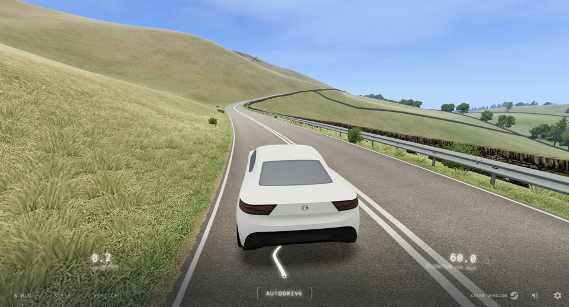
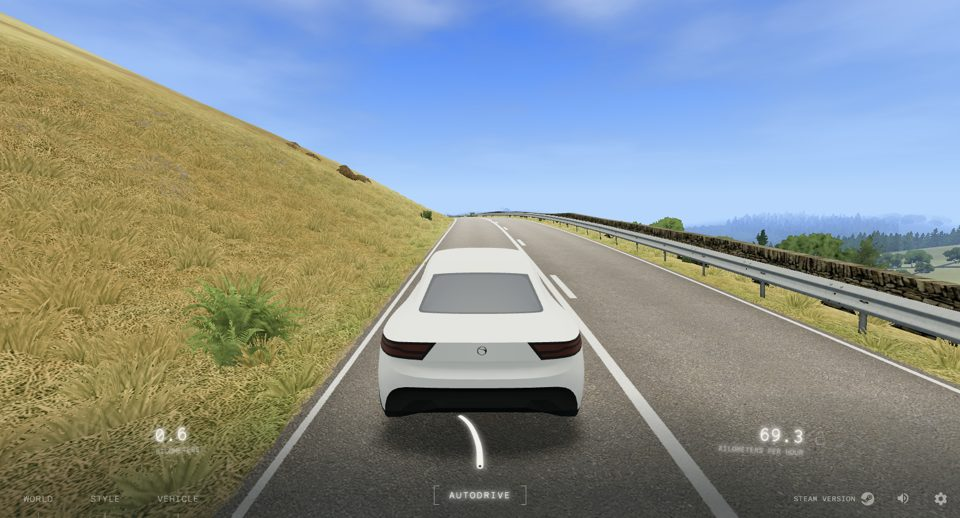
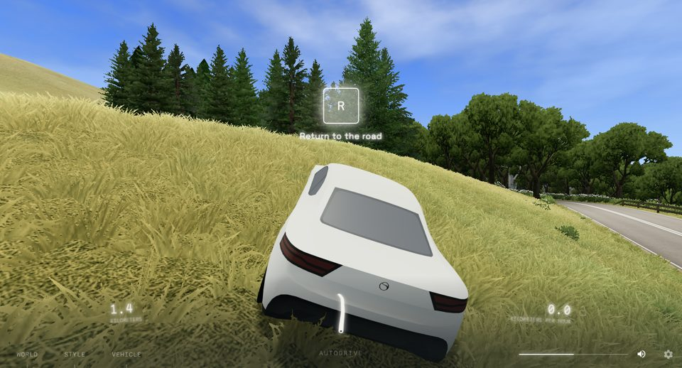

# Разбор slowroads.io: почему там легко, а у нас тормозит

2026-09-25. После тест-драйва ветки `country` вывод владельца был такой: «тормозит, тормозит, тормозит». Картинка и атмосфера нравятся, но впереди вода, реки, озёра, сезоны и погода, а на нынешнем фундаменте их не построить. В качестве образца назван slowroads.io: он работает в браузере и в Steam, заметно легче нас, и в нём есть сезоны и разный ландшафт.

Этот документ — разбор slowroads и замер нашей игры тем же способом. Смысл в том, чтобы взять их **основы** и строить на них **свой** визуальный стиль.

Лицензия. Код slowroads закрытый. Мы берём приёмы и порядок величин, а не код, шейдеры или ассеты.

## Как смотрели

- **Браузер.** Headless Chrome slowroads не пускает (проверка Cloudflare), обходить её мы не стали. Смотрели в обычном окне Chrome 154 с отдельным профилем, на той же машине, где шёл замер WebGL против WebGPU (M2 Pro).
- **Счётчик.** До загрузки страницы в неё встраивается перехватчик WebGL: он считает на каждый кадр вызовы отрисовки, треугольники (с учётом инстансинга), число экземпляров и собирает исходники шейдеров. Каждая цифра — медиана за 240 кадров.
- **Условия.** Окно 1600×863. У slowroads по умолчанию выключена «родная плотность пикселей», то есть рендер идёт в 1× — это их выбор по умолчанию, и мы его тоже учитываем. Режим AUTODRIVE, холмы (HILLS).
- **Наша игра.** Тот же сид и лесной участок, камера движется вдоль дороги со скоростью 15 м/с. Системы отключались по очереди, чтобы понять, что сколько стоит.

## Цифры

| | Отрисовок за кадр | Треугольников | Экземпляров | Кадр |
|---|---|---|---|---|
| slowroads, Medium / Medium (по умолчанию) | 88–94 | 235–277 тыс. | 18–29 тыс. | 8.3 мс (держит 120 Гц) |
| slowroads, Ultra / Ultra | 104–107 | 1.45–1.77 млн | 190–245 тыс. | 33 мс (30 fps) |
| **Мы, как сейчас** | **664** | **6.4 млн** | — | GPU 21.9 мс + CPU на отрисовку ~10 мс |

У slowroads 42 программы шейдеров на Medium (82 на Ultra) и 8–9 текстур.

Из чего складывается наш кадр. Системы отключались накопительно, поэтому каждая строка — это ещё минус одна система:

| Что в кадре | GPU, мс | Треугольники | Отрисовок |
|---|---|---|---|
| всё | 21.9 | 6.4 млн | 664 |
| без карты теней | 19.1 | 6.1 млн | 541 |
| + без травы | 14.5 | 5.4 млн | 587 |
| + без моделей деревьев | 7.9 | 1.8 млн | 405 |
| + без «открыток» | 5.6 | 0.5 млн | 389 |

Физика, машины, автопилот и трафик вместе занимают меньше 1 мс CPU. **Тормозит мир, а не игра.** Больше всего стоят деревья: 3.6 млн треугольников и 6–7 мс GPU. Дальше идут трава (4.5 мс), карта теней (2.9 мс) и «открытки» (2.3 мс). Кроме того, мы делаем в 7 раз больше отрисовок, и CPU только на их отправку тратит около 10 мс.

Ultra у slowroads тоже тормозит, и почти всю разницу между Medium и Ultra даёт трава: число экземпляров вырастает в 8–10 раз. Их Medium выглядит хорошо при 270 тыс. треугольников, то есть в 24 раза меньше нашего.

Скриншоты slowroads лежат здесь только как ориентир для сравнения, в игру они не идут.

## Как устроен slowroads (по шейдерам, ресурсам и кадрам)

**Стек.** three.js r155, WebGL2 с `antialias: true`, SvelteKit. Движок не особенный — такой же three.js, как у нас.

**Материалы.** Почти всё сделано на `MeshLambertMaterial`: 50 из 82 шейдеров. `MeshStandardMaterial` только в 4, физический материал — в 2 (машина). Туман `FogExp2`.

**Земля — один шейдер со всеми знаниями о мире в вершинах.** У вершины рельефа есть атрибуты `roadProximity`, `treeMask`, `fieldCol`, `overlap` и `shadow`. Они считаются один раз, когда генерируется кусок мира. Фрагментный шейдер смешивает несколько маленьких тайловых текстур (трава, песок, камень, гравий, лес, вереск) с учётом высоты текстуры (`terrainBlend`). Поверх кладутся детальный шум вблизи и вдали (`detailNearMap`, `detailFarMap`), две краски (`grassColA/B`, `peakColA/B`) и карта пятен (`grassVariationMap`). Все текстуры — webp по 20–90 КБ.

**Тени деревьев запечены.** Лес затемняет землю через атрибут вершины `shadow` и `treeMask`, а силу затемнения задаёт uniform `shadowFactor`. Трава берёт ту же запечённую тень и нормаль земли (`groundNormal`) — поэтому пучки лежат с землёй одним цветом. Карта теней PCF подключена во всех шейдерах, но на кадрах тени от деревьев на траве не видно, даже от машины на склоне. По кадрам похоже, что реальные тени у них почти ничего не рисуют. Какие именно объекты отбрасывают тень в карту, мы не проверяли.

**Трава — экземпляры-карточки с альфой.** Она «прорастает» по расстоянию (`sproutNear`, `sproutFar`) и приминается под машиной (`vehiclePos`, `flatten`). На Medium ~20–30 тыс. экземпляров, на Ultra ~200–250 тыс. Именно густота травы делает Ultra тяжёлым.

**Деревья.**
- 8 моделей в OBJ, кроны из карточек с атласом листвы (`summer_trees_*`).
- Вдали стоят «открытки» с цветом и нормалью (`summer_imposters_*_d`/`_n`), поэтому освещены они как объём.
- Переход между уровнями — растворение шумом по дистанции (`dissolveNear`, `dissolveFar`, `dissolveInterval`, `noiseMap`), а не пересортировка пачками.
- «Открытки» сняты с нескольких сторон: шейдер смешивает два соседних ракурса (`map`/`mapB`, `normalMapB`, `vAngleBlend`).
- Дальний лес — те же «открытки» до самой дымки. `forest_01` — не дальний лес, а лесная подстилка: шейдер земли подмешивает её под деревьями по `treeMask`. В первой версии этого разбора здесь было написано «дальний массив — текстура на земле»: вывод был сделан по имени файла без проверки, и он был неверен.

**Сезон — это данные, а не система.** Один uniform `seasonIndex` плюс свой атлас на сезон (`autumn_imposters_*`) и снег (`hasSnow`, `snow_spray`).

**Атмосфера.** Экспоненциальный туман плюс высотная дымка с шумом (`hazeHeight`, `hazeIntensity`), облака текстурой, тональная компрессия. Большую часть «красоты» даёт именно она, и стоит она почти ничего.

## Почему мы тяжелее

У нас на каждый вопрос картинки стоит отдельная система реального времени. У slowroads на тот же вопрос — запечённое число в вершине или один uniform.

| Вопрос | Мы | slowroads |
|---|---|---|
| Тень леса на земле | карта теней 2048², сотни деревьев в теневом проходе, 2.9 мс | атрибут `shadow` в вершине, 0 мс |
| Даль и лес на горизонте | «открытки» до 6 км + «одеяло» крон + vista | «открытки» с нормалью до дымки, дымка |
| Дерево вблизи | 4 уровня, ближний на сотни треугольников, пересборка корзин каждые 14 м | одна модель с кронами-карточками, растворение шумом |
| Трава | 3 кольца пучков из треугольников до 95 м, без записи глубины | карточки, растут по дистанции, тень и цвет берут с земли |
| Сезон | палитра, прошитая в геометрию деревьев | uniform + атлас |
| Отрисовок | 664 | ~90 |

## Что нам мешает взять их основы

Ничего принципиального. Движок тот же. Наши сильные стороны — физика, машины, автопилот, трафик, будущий сюжет — в кадре почти ничего не стоят и не мешают. Мешает только то, что мир построен из систем реального времени, а не из данных, посчитанных при генерации.

Свой визуальный стиль при этом остаётся нашим. Язык (лёгкий low-poly, щепотка туши, палитра, силуэты) задают текстуры, палитры, формы моделей и пост-проход. Фундамент (как посчитан мир и как он нарисован) можно взять у slowroads без их вида.

## Решение: новый рендер мира (2026-09-25)

Шаги по облегчению старого мира отвергнуты. Обрубленные дальности сделали его «искалеченным»: горизонт превратился в рваную полосу точек, а луг — в плоский тёмный ковёр. Решили так:

- **Новый рендер мира строится сразу в игре**, в ветке `country`, без лабораторий: лаборатории расходились с игрой и забрасывались. Старые системы заменяются целиком, параллельных версий не держим.
- **Визуальный язык свой, стилизованный.** Рисованные, а не фото, текстуры (генерируются в коде), своя палитра, щепотка туши. Основы (как посчитан и как нарисован мир) берём у slowroads.
- **Бюджет:** ~150 отрисовок и ~1 млн треугольников на кадр. Каждый этап проверяется в кадре игры с трёх дистанций (вблизи, средний план, горизонт над полем) и замеряется.

Порядок:

1. **Земля.** Один шейдер для тайлов, придорожной полосы и дали. Процедурные текстуры мазков (луг, посевы, лесная подстилка, земля и грязь) в двух масштабах, чтобы не было видно повтора. Веса слоёв, влажность и запечённая тень лежат в атрибутах вершин и считаются при генерации тайла. Цвет даёт палитра `landcover`, так что сезон — это смена палитры.
2. **Трава.** Карточки с рисованными пучками. Растут по дистанции, берут цвет и запечённую тень с земли. Заменяет нынешние пучки из треугольников.
3. **Деревья.** Стволы остаются кодом, кроны — рисованные карточки листвы вокруг масс. «Открытки» с нормалями. Лесной массив вдали — земля и дымка.
4. **Тени.** Тень леса запекается в вершины земли, тень в реальном времени остаётся только для машины и ближних объектов.
5. **Воздух.** Дымка по высоте, туман в цвет неба.

## Ход работ

### Шаг 1. Деревья (2026-09-25)

Замер тем же стендом: лесной участок, сид `flick`, камера на 15 м/с, 2 Мпикс, M2 Pro.

| | GPU, мс | Треугольники | Отрисовок |
|---|---|---|---|
| до | 21.9 | 6.4 млн | 664 |
| модели до 150 м вместо 420 | 12.2 | 3.6 млн | 667 |
| «открытки» до 1.2 / 3 км вместо 2 / 6, «одеяло» с 1 км | 12.2 | 2.4 млн | 639 |
| ствол и крона одной геометрией | 12.5–12.9 | 2.4 млн | 524 |

Разброс GPU между прогонами ±0.7 мс.

- **Главный выигрыш дала дальность моделей.** Дальняя модель в 250–1100 треугольников рисовалась до 420 м, то есть десятками тысяч деревьев.
- **«Открытки» стали освещаться нормалями, запечёнными с модели** (второй атлас), как у slowroads. Без этого крона на 150–300 м была плоской и светлой.
- **Между ячейками атласа добавлены поля.** Без них на мипах над макушками висели чёрточки: подножие дерева из соседней ячейки.

Что осталось в кадре, накопительно по системам:
- тени — около 2 мс;
- трава — около 2.5 мс;
- модели деревьев — 0.7 млн треугольников, 1–2.5 мс;
- «открытки» — около 1 мс;
- всё остальное (земля, даль, дорога, пропсы, пост-проход) — около 5.4 мс GPU и 370 отрисовок.

CPU на отрисовку — около 6.5 мс за кадр.

`BatchedMesh` для деревьев не взят. На Metal (через ANGLE) каждая его под-отрисовка остаётся отдельной командой, а деревьев в кадре тысячи.

После показа шага 1 владелец отверг путь обрубания: горизонт в открытом поле стал рваной полосой точек. Дальности «открыток» и «одеяла» возвращены (2 и 6 км, «одеяло» с 1.8 км), дальнее растворение снова идёт целыми деревьями. Модели до 150 м и «открытки» с нормалями остались.

### Новый рендер, этап 1: земля (2026-09-25, идёт)

`src/render/groundpaint.ts` рисует при загрузке одну текстуру 512² с четырьмя серыми узорами, по одному на канал:
- R — луг: веера травинок поверх тёмных просветов;
- G — посевы: стебли по рядкам;
- B — лесная подстилка: листья и пятна;
- A — голая земля: комья.

Мазки ложатся поверх друг друга, как краска, и слегка постеризуются. Цвет по-прежнему даёт палитра `landcover`, узор только меняет его яркость. Поэтому сезон остаётся сменой палитры.

Веса четырёх узоров считаются при генерации тайла (`writeGroundWeights` в `deserttiledata.ts`) и лежат в атрибуте `aGround`. У меша без этого атрибута получается просто луг. Узор берётся в двух масштабах (4.2 и 11.5 м) под разными углами, поверх лежит пятнистость на 140 м. Мипмапы сводят мазки к нейтральному среднему, так что вдали земля сохраняет цвет палитры и не мерцает.

Первая версия мазков (редкие тонкие «волоски» на сером) выглядела в кадре как мятая бумага или рябь на воде. Переделано на крупные веера травинок, которые перекрывают фон.

Периоды узора — 4, 12.5 и 125 м. Узор берётся в координатах относительно начала отсчёта, а оно перескакивает каждые 1000 м (`REBASE_STEP`). Первые периоды (4.2, 11.5, 140 м) 1000 не делили, и при каждом перескоке узор земли под машиной сдвигался бы рывком.

### Этапы 2–5: трава, деревья, тени, воздух (2026-09-25)

Замер тем же стендом: лесной участок, сид `flick`, камера на 15 м/с, 2.25 Мпикс, M2 Pro. Отрисовки и треугольники сильно зависят от того, сколько машин трафика в кадре, поэтому разброс между прогонами — до ±60 отрисовок.

| | GPU, мс | Треугольники | Отрисовок | Кадров/с без vsync |
|---|---|---|---|---|
| перед этапом 2 | 15.1 | 3.3 млн | 532 | 112 |
| трава-карточки | 12.7 | 2.6 млн | 621 | 125 |
| столбы ЛЭП одним мешем на кусок дороги, тени только вблизи | 13.2–13.6 | 2.4–2.7 млн | 310–379 | 120 |
| «открытки» только в секторе обзора | 12.0 | 1.56 млн | 337 | 150 |

В пересчёте на пиксели мы теперь около slowroads Medium: у них 8.3 мс при 1.38 Мпикс, у нас 12 мс при 2.25 Мпикс.

Что осталось в кадре, накопительно по системам:
- тени — около 0.9 мс;
- трава — около 1.3 мс (в других прогонах 0.4: она почти не видна в замере);
- модели деревьев — 0.6 млн треугольников, около 2.4 мс;
- «открытки» — 0.35 млн треугольников, около 1.5 мс;
- всё остальное (земля, даль, дорога, пропсы, машины, пост-проход) — около 6 мс GPU и 225 отрисовок.

**Трава** (`src/world/grass.ts`, `src/render/tuftpaint.ts`). Пучок — один квадрат, повёрнутый к камере, с рисованным пучком из атласа. Рисунки делаются в коде при загрузке: веер широких листьев с тёмным корнем, светлым кончиком и тонкой тёмной каймой, задние листья тусклее передних. Четыре вида (луговой пучок, кочка, цветущая трава, колосья) по два рисунка. В атласе лежит не цвет, а данные: тень от корня к кончику, маска цветка или колоса, покрытие. Цвет корня — цвет земли под пучком с тем же пятнистым узором, что у земли, поэтому пучки и земля читаются одним лугом, а сезон остаётся сменой палитры.
- 30–50 тыс. пучков по 2 треугольника вместо 55 тыс. вееров по 15. Треугольников травы в кадре — около 11 тыс. вместо 740 тыс.
- Пучки за спиной и сбоку от камеры отбрасываются в вершинном шейдере.
- Края гладкие без сортировки и смешивания: покрытие идёт через alpha-to-coverage при MSAA, с поправкой на мип-уровень, чтобы дальние пучки не таяли.
- Глубину трава не пишет, иначе обводка тушью превращает луг в каракули. Порядок отрисовки поэтому совпадает с порядком видимости: каждое кольцо проходит свою сетку от дальнего края к камере, дальнее кольцо рисуется первым.
- На внешнем краю (66–90 м) пучки врастают в землю. В её узоре те же мазки, так что края не видно.

Первая версия была слишком редкой (газон с точками) и тускло-оливковой. Плотность и светлота кончиков подняты, цветов вдвое меньше: при 22% цветущих пучков средний план выглядел как конфетти.

**Столбы ЛЭП** (`src/world/props/poles.ts`). Каждый столб был группой из шести мешей, каждый пролёт провода — отдельной трубой: 232 отрисовки из 476 при 600 треугольниках на кусок дороги. Теперь все детали столбов куска дороги запекаются в его координаты и сливаются в один меш на материал, все провода — в один меш.

**Деревья и тени.** Уровней деревьев два, а не три: ближняя модель до 60 м, дальняя — до «открыток». В теневую карту попадают только ближние модели, тени гаснут на 40–55 м вместо 78–100, теневая карта 104 м вместо 144 (при тех же 2048² это 5 см на тексель вместо 7). Отрисовок деревьев стало 78 вместо 117, в теневом проходе — 39 вместо 78.

Тень леса на земле запечена, как у slowroads: пол леса темнее на 34% по весу лесной подстилки в вершине тайла (`FOREST_SHADE` в `groundpaint.ts`), и трава под деревьями берёт ту же тень. Она не зависит от расстояния, поэтому кольца, где кончаются настоящие тени, не видно. Заодно исправилось давнее: пол ельника был того же лимонного цвета, что и луг.

**«Открытки»** (`src/world/impostors.ts`). В хранилище лежат все дальние деревья на 6 км вокруг, около 600 тыс., и видеокарта каждый кадр расставляла все, чтобы отбросить две трети за спиной и сбоку. Теперь на видеокарту уходят только плитки в конусе вокруг направления взгляда. Список пересобирается, когда взгляд повернулся на 10° или камера проехала 40 м, а конус взят с запасом на этот поворот и сдвиг. Треугольников «открыток» стало 0.35 млн вместо 1.24 млн.

**Воздух** (`src/render/lightshader.ts`). Туман уже был в цвет горизонта неба (`sky.ts`). Добавлена дымка по высоте: плотность тумана умножается на среднюю плотность воздуха вдоль луча, который редеет с высотой в e раз на 70 м. Считается от высоты глаза, а не от уровня моря: рельеф между районами гуляет на 200 м, и дымка на абсолютной высоте залила бы один район и оставила голым другой. На ровной земле множитель равен 1, так что цвет и густота тумана прежние. Долина ниже дороги тонет в дымке, холм выше стоит яснее.

Что видно в кадре и ещё не сделано:
- На некоторых участках (сид `flick`, 1 и 4.7 км) обочина и луг бледно-лимонные под полуденным солнцем. Это цвет палитры `landcover`, трава его только повторяет.
- Земля пока не единый шейдер для тайлов, придорожной полосы и дали (этап 1), и вершины не хранят близость дороги.
- Кроны деревьев — по-прежнему геометрия, а не рисованные карточки листвы: по замеру модели стоят 2.4 мс, и до 150 м это приемлемо. Переделка крон — отдельный шаг, если понадобится.
- Машины трафика — около 15 отрисовок на машину и заметная доля оставшихся 225.

### После тест-драйва владельца (2026-09-25)

Картинку приняли. Два замечания:

- **Трава «причёсывалась» вокруг машины.** Первая починка сделала хуже, и проверена она была только статичными кадрами. Карточки поворачивались к камере, и их я закрепил. Но густоту я сделал убывающей с расстоянием, а прореживание — через рост: лишние пучки не исчезали, а росли от нуля, пока камера подъезжала с 28 до 10 м, и ложились, пока она удалялась. Вокруг машины ехал пояс травы, которая поднималась впереди и ложилась позади, как под невидимым колесом.

  Правило теперь такое: в ближнем кольце (до 45 м) ничто в пучке не зависит от расстояния до камеры. Одна сетка постоянной густоты, пучок — две скрещённые карточки, повёрнутые один раз в мире. Второе кольцо (45–90 м) вдвое реже, с карточками в 1.4 раза шире. На стыке каждый пучок передаётся на своём расстоянии в полосе 8 м, прорастание из земли — на 70–90 м.

  Проверка — стенд `camdep`: один и тот же кадр рисуется дважды, во второй раз трава считает, что камера на 12 м дальше, и кадры вычитаются. До 45 м разница — ноль пикселей, она есть только в полосе 45–90 м. Цена травы — около 1.5 мс GPU и 270 тыс. треугольников.
- **Деревья вдали — «страх и ужас»:** висящие в воздухе стволы, половинки крон, тёмные прямоугольники. Это старая ошибка запекания «открыток», её было видно только на экране 2×. `renderer.setViewport` в three задаётся в CSS-пикселях и умножается на плотность пикселей даже при рисовании в текстуру. На Retina каждая ячейка атласа рисовалась вдвое крупнее и со сдвигом, и «открытки» показывали обрезки соседних деревьев. Стенд снимал в 1×, поэтому ошибку не видел. Окно ячейки теперь задаётся самой текстуре. Стенд снимает и в 2× (`DPR=2`).

### Второй тест-драйв: запись экрана (2026-09-25)

Владелец записал езду с камерой погони. По записи видно три вещи, и все три — мои.

- **Круг вокруг машины.** Это край настоящих теней. Я сократил их до 40–55 м ради скорости, и вдоль лесной дороги пятнистая тень вблизи обрывалась в сплошной свет дальше; граница ехала с машиной. Тени возвращены: гаснут на 78–100 м, средние модели деревьев (60–110 м) снова их отбрасывают. Отрисовок снова около 400, GPU 12.7 мс.
- **«Причёсанная» трава.** Камера погони смотрит сверху, а вертикальные линии при взгляде сверху сходятся к точке под камерой: каждый пучок становится лучом, веер лучей едет с машиной. Трава кольцами вдобавок меняла густоту на 45 м, а кончики пучков были зеленее земли, так что сбоку трава выглядела темнее, чем сверху. Теперь как в slowroads (их шейдер травы: экземпляры постоянной густоты, уход в землю на дальнем краю, срезанная вдвое высота): одна сетка до 70 м, пучки вдвое ниже при той же ширине, кончики цвета земли.
- **Дальний лес — голые полосы.** За 2 км лес был «одеялом» — приподнятой землёй. Теперь каждое пятое лесное дерево (выбор по хешу позиции, `src/world/farwoods.ts`) остаётся «открыткой» до 4.5 км. За 2 км оно плавно расширяется в 1.8 раза, пока остальные растворяются по одному, так что лес не редеет. «Одеяло» поднимается только за 4.2 км, в дымке.

Смена модели на «открытку» на ~150 м шла по пиксельной сетке экрана и давала зерно. Теперь это alpha-to-coverage: «открытка» проявляется в первой половине полосы, модель гаснет во второй, дыр между ними нет, а при MSAA дробное покрытие сводится в смешивание.

Как проверялось: запись езды с камеры на высоте 4.5 м с наклоном вниз, как у камеры погони (`chase.mjs`); стенд `camdep` (до 70 м трава не меняется, когда камера сдвигается на 12 м, кроме полосы ухода в землю 55–70 м); вид с холма в 2×.

### Третий круг: проверка настоящей машиной (2026-09-25)

Стенд `car.mjs`: игрок садится в машину, машина ставится на полосу на нужном километре и удерживается там, пока не подгрузятся коллайдеры, потом включается автопилот (клавиша P) и пишется экран с камерой погони. Так проверено всё ниже: лес (4.6 км), поля (1 км), холмы (20 км).

- **Тон травы зависел от угла взгляда.** Сверху между пучками видна земля, сбоку — одни пучки, а пучки были темнее земли (корень — 62% её цвета). Вблизи машины трава выходила светлее, дальше темнее, и эта граница ехала с машиной. Теперь средний тон пучка равен тону земли: корень 66%, кончик 124%, средняя тень рисунка около 0.55. Объём у пучков остался, а зависимости от угла нет.
- **Лимонная обочина.** «Сухой луг» палитры `0xbdb67c` под полуденным солнцем читался кислотным. Теперь `0xa8a870`, сочный луг `0x8aa65a`, межа `0x9ba767`.
- **«Открытки» с шести ракурсов**, как у slowroads. Каждый вариант дерева запекается с шести сторон (атлас 2016×2304, 8 бит, цвет в sRGB, около 50 МБ видеопамяти вместе с нормалями). Шейдер находит сторону, с которой камера видит дерево, с учётом его собственного поворота, и смешивает два соседних ракурса. Кривой дуб или ива вдали больше не поворачиваются к машине одной и той же стороной.
- **Падение при загрузке** (`isReady` of undefined). Прогрев шейдеров ждал готовности всех материалов сцены, а подгрузка мира тем временем уничтожала материалы выгружаемых кусков. Теперь прогрев машин компилирует только машины, а оба места ждут через `compileSafely` (`src/render/compilesafe.ts`): уничтоженный материал считается готовым. Пять загрузок подряд — без ошибок.
- **Пустые пачки деревьев** больше не рисуются: в лесу 88 отрисовок деревьев вместо 117, в тенях 57 вместо 78.

Итог на том же стенде: GPU 12.6 мс при 2.25 Мпикс, около 400 вызовов отрисовки вместе с теневым проходом и пост-проходом (в начале было 664), 1.94 млн треугольников, кадр 7.8 мс (около 128 кадров/с без vsync).

Решения, а не долги:
- **Кроны остаются геометрией, а не карточками листвы.** Они стоят около 2.4 мс и держат наш стиль; карточки листвы — это вид slowroads, а не их скорость.
- **Земля тайлов и дали — разные шейдеры.** Шва между ними не видно: узор земли к дали уходит в средний цвет палитры, а цвет дали берётся из той же палитры `landcover`.
- **Отрисовок около 400 при ориентире 150.** Основное — деревья: 39 вариантов на 3 уровня, и каждый — отдельный вызов. Кадр при этом укладывается в 8 мс, поэтому варианты деревьев ради числа вызовов не урезаются.
